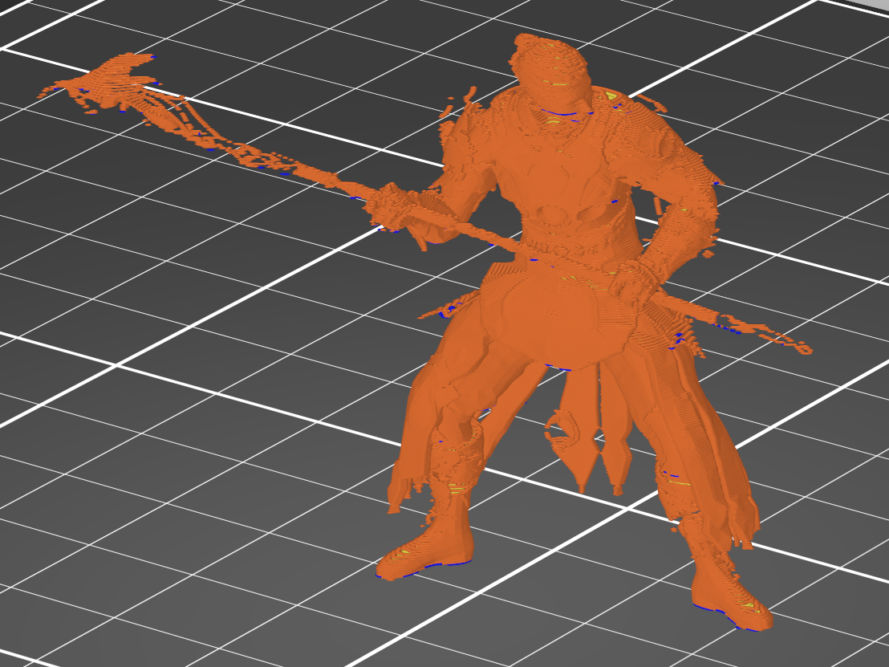
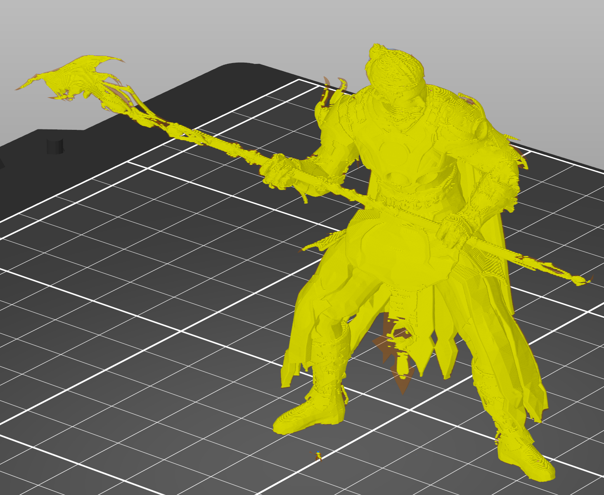
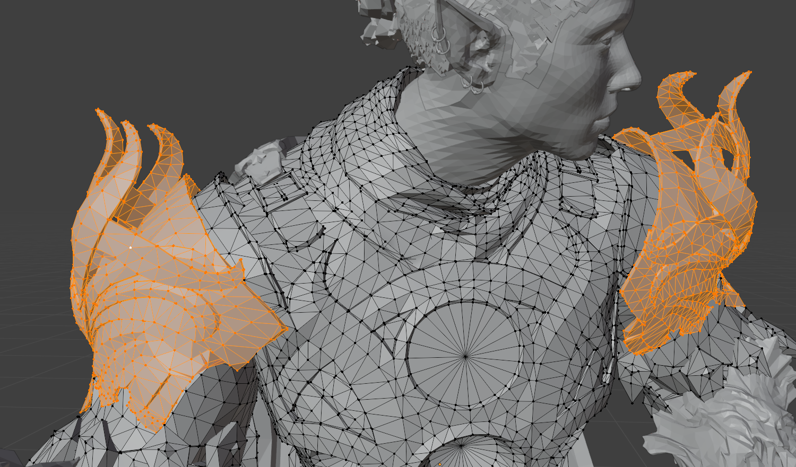
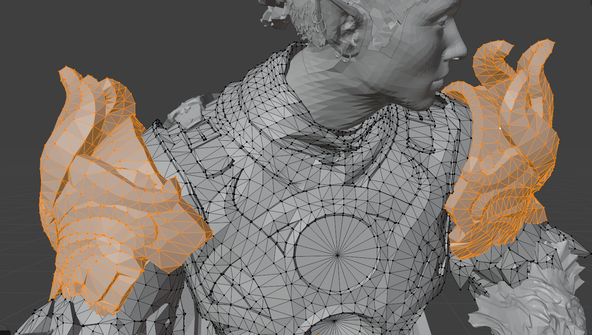
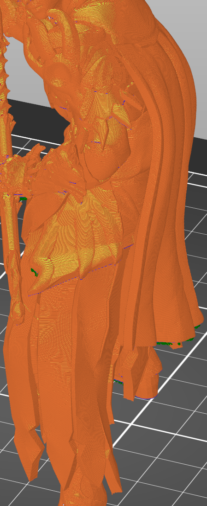

# Print preparation in Blender

This is where the long, tedious part of the process starts.
We need to ensure the model is clean for 3D printing.

The central concept you must understand for this phase is manifold geometry.
For a 3D model to be printable, it must be manifold, meaning it forms a strictly enclosed volume.
In a mathematically correct manifold mesh, **every** edge connects exactly two faces, which allows for the clear calculation of the inside and the outside volume of the object.

Video game assets are designed to look good from specific camera angles and use various visual tricks to simulate depth and detail.
They consist of zero-thickness surfaces and frequently contain intersecting geometry that does not physically connect.
To a 3D printer slicing software, these assets are essentially unintelligible.

Beyond fixing the topology, we must also adapt the physical properties of the mesh for the real world.
Elements like hair strands, loose cloth, or thin armor plating often exist as two-dimensional planes or very thin objects in the game.
These need to be solidified and extruded to have physical thickness to exist as plastic.
Furthermore, microscopic details that look great on a monitor must often be simplified or exaggerated, as they may be smaller than the physical resolution of your printer nozzle.

The objects may look correct in Blender or in the Slicer object view.
However, if you attempt to slice the model directly after import, you will likely encounter missing layers, floating artifacts, or complete structural failure.

<table>
<tbody>
<tr>
<td></td>
<td></td>
</tr>
<tr>
<td>The mesh looks good when viewed in the model view.</td>
<td>Slicing it reveals missing layers everywhere.</td>
</tr>
<tr>
<td></td>
<td></td>
</tr>
<tr>
<td>Attempting to use several pieces of automated 3D-printing fixing software did not result in a usable mesh.</td>
<td>Small hidden broken meshes may reveal themselves only upon closer inspection, so find them before you print!</td>
</tr>
</tbody>
</table>

This chapter covers the manual process of converting these hollow surfaces into a single, printable solid.
While automated repair tools exist, they frequently destroy the specific details required for a character figure or fail to resolve the complex internal geometry of game rips.
We will manually close gaps, merge mesh islands, and enforce manifold geometry to ensure structural integrity.

I will sometimes provide short unlisted YouTube clips of certain tasks being performed in blender.
Keep in mind that, as with everything in this tutorial series, these are merely my personal workflows and ideas.
I often went back to the things done in the videos and made further adjustments.
Feel free to iterate on anything I provide you with in this guide.

## Blender setup

Let's enable a few viewport settings that will make our lives easier later.

### Clip Start

Lower the "clip start" property of the editor, since we are going to zoom in a lot (`right side > view (n) > clip start > something like 0.001m`).

### Scene Statistics

I would recommend enabling scene statistics to see the vertices, faces and triangles.

<table>
<tbody>
<tr>
  <td>
    
    
  </td>
  <td></td>
</tr>
<tr>
<td>Approach 1 (<code>Window > Show Status Bar</code>, <code>Status Bar Right Click > Scene Statistics</code>) (only shows global statistics).</td>
<td>Approach 2 (<code>Viewport Overlays > Statistics</code>) (also filters to selected object).</td>
</tr>
</tbody>
</table>

### Face orientation

Enable the "face orientation" viewport overlay, this will help us understand better what parts of the mesh still need fixing (`viewport overlays > face orientation`).

In case you find the color of the backwards facing material too intensely red, you can configure a custom color in `Preferences > Themes > 3D Viewport > Face Orientation Back`.

## Object preparation

### Take inventory of the objects

Each individual object _may be_ overlayed by several copies of itself that the game uses for visual effects.
Remove the copies of the objects.
Since they are all identical, it does not matter which of the ones you keep.
Additionally, there may be empty objects with no mesh data, remove them as well.

Then, rename all your body parts to more easily identify them later.

### Join objects

You _might want_ to join the most relevant objects into single objects (shield, weapon, cape).
But at the same time, it might be easier to edit individual objects later on, this clearly depends on the character and accessories.
You decide what makes the most sense to you and whether you might defer this until later.

### Merge overlaying vertices

> In action: https://youtu.be/r6ea8ANrplY

Objects are commonly split up into multiple meshes with overlapping vertices and edges.
For this, select all objects (`a`), enter edit mode (`tab`), select all vertices (`a`) and use the `Mesh > Clean Up > Merge by Distance` action.

### Shade flat

We will be covering how to smoothen your model later on in more detail, but for editing the mesh it is more useful to directly see the faces as they are.
So, select all objects and `Right Click > Shade Flat`.

## Intermission: General practices

Before we get started cleaning up the model:
There are some tips and tricks and shortcuts in blender we will be using very commonly later, so I'll discuss them here once at the start.

By the way, whenever you want to run an action and don't know where to find it, you can press `F3` and simply enter its name.
Not only is this a shortcut for all actions, it also shows where to find them and what shortcut is assigned to them.

### Navigating the scene

#### Objects

> Showing some of the shortcuts in action: https://youtu.be/g_-OnZa03ZI

- Select an object or a set of vertices and press `num-delete` to zoom in on the items.
  This will also reset your camera zoom level to match the selected object scale, which can be very useful if your camera is too far zoomed in, and you cannot move it well anymore.
- Select an object and press `num-slash` to focus on the object and hide all others.
  Your camera position will be saved and returned to when you press the key again.
- `ctrl+mouse wheel press` for zooming in and out smoothly without steps is useful for zooming on small scales when one step would zoom over multiple layers of the mesh.
- `alt+z` is to enable x-ray mode to allow seeing through objects.
  This is immensely useful in combination with the "select non-manifold geometry" action.

In case you don't have a numpad, I would recommend reconfiguring those shortcuts.
All other blender shortcuts are obviously also useful, I just wanted to highlight my personal most important ones.

#### Meshes

- You can select islands (connected geometry) by clicking on a vertex on an island (hold shift to select even more) and press `ctrl+l` to select the entire island
- Focusing on specific islands is easy too:
  Select the islands using the shortcut above, press `ctrl+i` and `h` to hide all other vertices.
- Use `alt+h` to show the entire mesh again.

### Selecting non-manifold geometry

This is going to be one of the main actions we will be running all the time.
Our goal for each individual object is to have no more vertices highlighted by this action.

The action is `Select > Select All by Trait > Non Manifold`.
I manually set the shortcut to `ctrl+shift+g` since I used it this often.

In combination with the `ctrl+l`, `ctrl+i` and `h` shortcuts, this allows you to very quickly select all parts of the mesh that still need your attention and hide all others.

### Face orientation

> Fixing non-manifold by recalculating face orientation: https://youtu.be/DDzGjyC__e8

Remember that you activated the "face orientation" viewport overlay earlier.
Sometimes all it takes to make a mesh manifold is to recalculate the mesh normals.
The action is `Mesh > Normals > Recalculate Outside` or just `Shift+N`.

You can do this once now before you start working on the actual cleanup by selecting all objects and entering edit mode.
This will likely already remove a lot of the red surface from your mesh.

But most importantly:
whenever you made a change to the mesh that closes an object and you have the feeling that the outside calculation should now be working fine again, you should once again run this action and you will see that the colors correct themselves.

### Closing objects

Since the main objective is to fill the missing faces of the objects on your character, we should discuss multiple ways you can do so quickly.

- You can insert faces by selecting three or more vertices at once (`shift`) and pressing `f`.
- If you select a single vertex and press `f`, Blender will attempt to find neighboring vertices and fill a triangular face between them, which works well on flat meshes.
- If you select two vertices and press `f`, it will fill a quad to the next to.
- If you hold `alt` and click on an edge, it will attempt to select all vertices in an edge loop.
  You can then press `f` and fill the entire loop at once.
- If you have a face that is not a tri or a quad, you should triangulate the face by selecting it and pressing `ctrl+t`.

> All this in a quick video: https://youtu.be/xbxgMpQY6uY

Since a property open geometry is that it is non-manifold, you can often very easily select these vertices using the action/shortcut named above, press `f` and `ctrl+t` and you are done.

> Using non-manifold selection: https://youtu.be/2jvjCddpQF0

But be aware that you might not always want to close objects this way!
The next chapter shows why.

### Scaling objects

Depending on your hardware, 3D printer settings and printing size, the print resolution may be limited to a value that is not sufficient to see all the detail of the model.
Not only is that a problem from an aesthetic point, but also from a structural one:
Objects may not be large enough to be visible on the print, or are connected via bridges that are too small to actually be printed.
There are multiple ways to ensure the mesh is okay in this regard.

#### Regular scaling

You can obviously simply scale an object using `s`, and filter for dimensions using `xyz`.
Always remember that you can switch the `Transform Orientation > Normal` to use a more relevant coordinate system for transformations to your mesh segments.
You don't have to switch back to global to get its coordinate system, simply hit `xyz` twice and you will get the global alignment lines.

When scaling, it might also be interesting to set the `Transform Pivot Point > Individual Origins` since you can scale multiple islands or objects at once as if you scaled them individually.

#### Proportional scaling

Next, you can press `alt+s` to scale along the normals of your mesh.
Good for thickening objects in all directions proportionally.

You should use this on small bridges in your mesh, like the legs, and horns of the creature on the staff of the image above, but also on thin parts of the mesh like clothing.

> Here are two examples for this: https://youtu.be/qRBrq-bey44 (general use), https://youtu.be/_n7-2iu2wSE (cloth)

#### Extrude along normals

This is the part where I reference the previous chapter.
Because if you use `s` or `alt+s`, sometimes in order to make a part of an object visible enough for printing it also distorts it visually too much such that it does not look good any more.
For this reason, you might want to consider the following situation:

You have a non-manifold "broken" mesh that is a plane with no thickness or you can easily get to this situation by removing one or two edge loops.
In this case, you can select all vertices of the mesh and use `alt+e` to `Extrude > Extrude Faces Along Normals`.

After you have solidified the object with that, you can still scale it using any of the operations above.

## Cleanup

Now let's get started with actually fixing the model.

Exporting an `.stl` file now and slicing it in your slicer software should result in something like in the image below.
We will check in on it sometime again to see the effects of our actions.

---

For each object:

- select individual object
- ctrl+i, h, numpad delete to focus on object
- enter edit mode

To select all islands that have non manifold geometry:

- "select" > "by trait" > "non manifold" (this is what we are after)
- ctrl+l, ctrl+i, h

If you have islands that you would not expect to connect:

- select one island, ctrl-click on the other --> shortest path between

To quickly fill an entire area either of the area type:

- large area surrounded by a clear edge boundary: alt-click on the edge and press f --> triangulate faces (ctrl+t)
- small irregular portions: click one (smart, order matters) or three (explicit) vertecies and press f
- bridge edge loops

If you work in a tight space, you can always hide one half of the model to view the inside of the other

Hair:

- solidify (choose value yourself)
- decimate (around .5)
- save before applying
- apply both
- it does not matter if you have non-manifold here, it's going to be dense enough anyways

And now time to prepare the model for 3D printing:

- all thin or small parts, make them thicker or larger, alt+s is good for most
- move the shoes in a way that the character stands firm on the ground, potentially make them larger to ensure good footing
  - tieflings already have a resting support lol
- don't forget that proportional editing exists
- edit identical islands at the same time (ctrl+l on all) with individual origins
- and so on idk.

Smoothen out certain parts:

- you can select the object you want to have subdivided to be smoother and enter edit mode
- select > sharp edges > 25° (depends on the model)
- right side > Item > Edges Data > Mean Crease > 1.0
- object mode add subdivision modifier (1, 2, 3 levels idk)
- apply (maybe only later when you really need it)
