# Print preparation in Blender

- [Blender setup](#blender-setup)
- [Object preparation](#object-preparation)
- [Intermission: General practices](#intermission-general-practices)
- [Cleanup](#cleanup)
  - [Cleanup Phase 1: Geometry Repair](#cleanup-phase-1-geometry-repair)
  - [Cleanup Phase 2: Structural Adaptation](#cleanup-phase-2-structuralaesthetic-adaptation)
  - [Cleanup Phase 3: Smoothing](#cleanup-phase-3-smoothing)

This is where the long, tedious part of the process starts.
We need to ensure the model is clean for 3D printing.

The central concept you must understand for this phase is manifold geometry.
For a 3D model to be printable, it must be manifold, meaning it forms a strictly enclosed volume.
In a mathematically correct manifold mesh, **every** edge connects exactly two faces, which allows for the clear calculation of the inside and the outside volume of the object.

Video game assets are designed to look good from specific camera angles and use various visual tricks to simulate depth and detail.
They consist of zero-thickness surfaces and frequently contain intersecting geometry that does not physically connect.
To a 3D printer slicing software, these assets are essentially unintelligible.

Beyond fixing the topology, we must also adapt the physical properties of the mesh for the real world.
Elements like hair strands, loose cloth, or thin armor plating often exist as two-dimensional planes or very thin objects in the game.
These need to be solidified and extruded to have physical thickness to exist as plastic.
Furthermore, microscopic details that look great on a monitor must often be simplified or exaggerated, as they may be smaller than the physical resolution of your printer nozzle.

The objects may look correct in Blender or in the Slicer object view.
However, if you attempt to slice the model directly after import, you will likely encounter missing layers, floating artifacts, or complete structural failure.

<table>
<tbody>
<tr>
<td>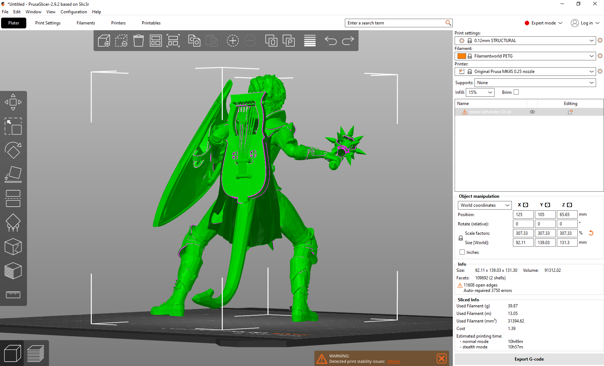</td>
<td>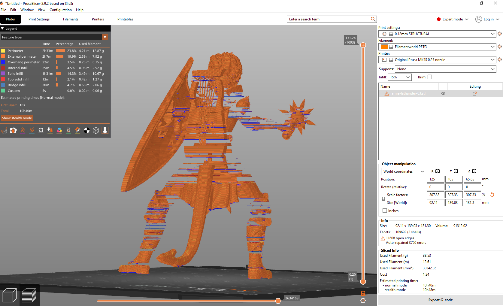</td>
</tr>
<tr>
<td>The mesh looks good when viewed in the model view.</td>
<td>Slicing it reveals missing layers everywhere.</td>
</tr>
<tr>
<td>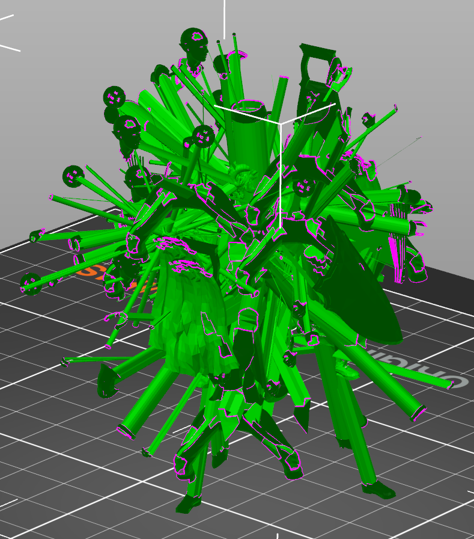</td>
<td>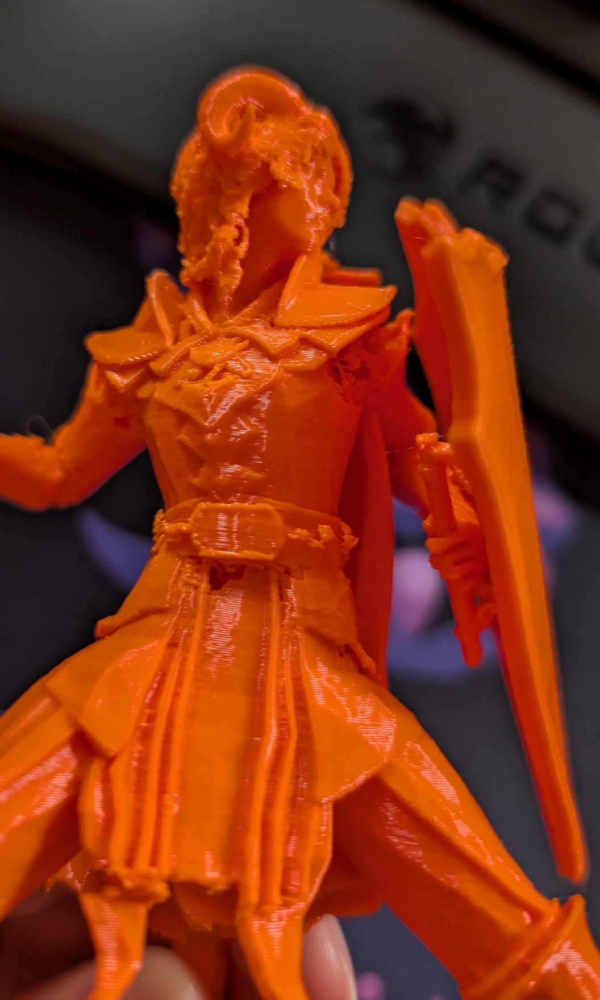</td>
</tr>
<tr>
<td>Attempting to use several pieces of automated 3D-printing fixing software did not result in a usable mesh.</td>
<td>Small hidden broken meshes may reveal themselves only upon closer inspection, so find them before you print!</td>
</tr>
</tbody>
</table>

This chapter covers the manual process of converting these hollow surfaces into a single, printable solid.
While automated repair tools exist, they frequently destroy the specific details required for a character figure or fail to resolve the complex internal geometry of game rips.
We will manually close gaps, merge mesh islands, and enforce manifold geometry to ensure structural integrity.

I will sometimes provide short unlisted YouTube clips of certain tasks being performed in blender.
Keep in mind that, as with everything in this tutorial series, these are merely my personal workflows and ideas.
I often went back to the things done in the videos and made further adjustments.
Feel free to iterate on anything I provide you with in this guide.

I recommend saving incrementally numbered or named copies of your work as backups regularly to not only avoid losing work, but also to be able to reverse destructive actions on your mesh.
I saved mine after each individual object I repaired:
`initial.blend`, `1.blend`, `2.blend`, ... `12.blend`.
This also helped for creating this guide, as I could always go back and record some section again or snap a screenshot of an earlier state.

## Blender setup

Let's enable a few viewport settings that will make our lives easier later.

### Clip Start

Lower the "clip start" property of the editor, since we are going to zoom in a lot (`right side > view (n) > clip start > something like 0.001m`).

### Scene Statistics

I would recommend enabling scene statistics to see the vertices, faces and triangles.

<table>
<tbody>
<tr>
  <td>
    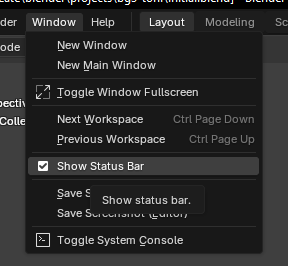
    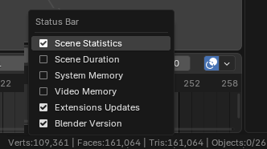
  </td>
  <td>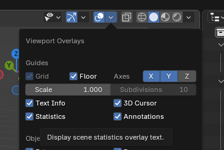</td>
</tr>
<tr>
<td>Approach 1 (<code>Window > Show Status Bar</code>, <code>Status Bar Right Click > Scene Statistics</code>) (only shows global statistics).</td>
<td>Approach 2 (<code>Viewport Overlays > Statistics</code>) (also filters to selected object).</td>
</tr>
</tbody>
</table>

### Face orientation

Enable the "face orientation" viewport overlay, this will help us understand better what parts of the mesh still need fixing (`viewport overlays > face orientation`).

In case you find the color of the backwards facing material too intensely red, you can configure a custom color in `Preferences > Themes > 3D Viewport > Face Orientation Back`.

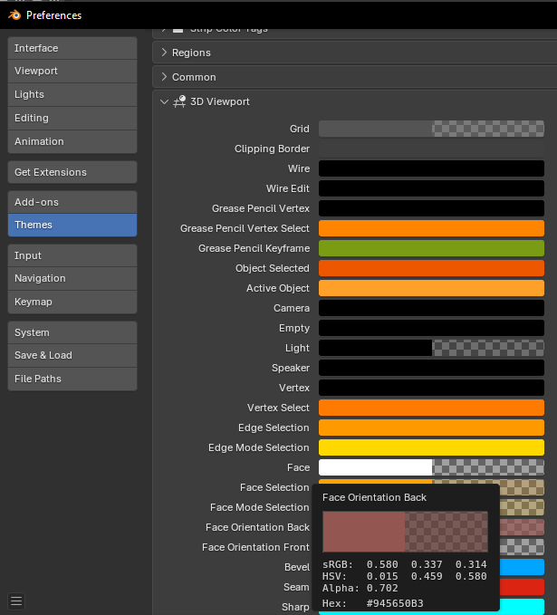

## Object preparation

### Take inventory of the objects

Each individual object _may be_ overlayed by several copies of itself that the game uses for visual effects.
Remove the copies of the objects.
Since they are all identical, it does not matter which of the ones you keep.
Additionally, there may be empty objects with no mesh data, remove them as well.

Then, rename all your body parts to more easily identify them later.

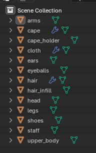

### Join objects

You _might want_ to join the most relevant objects into single objects (shield, weapon, cape).
But at the same time, it might be easier to edit individual objects later on, this clearly depends on the character and accessories.
You decide what makes the most sense to you and whether you might defer this until later.

### Merge overlaying vertices

Objects are commonly split up into multiple meshes with overlapping vertices and edges.
For this, select all objects (`a`), enter edit mode (`tab`), select all vertices (`a`) and use the `Mesh > Clean Up > Merge by Distance` action.

> In action: https://youtu.be/r6ea8ANrplY

You can also always merge vertices manually by selecting all you want to merge and using `Mesh > Merge > At Center`.

> Example: https://youtu.be/ctSYTmjMp4w

### Shade flat

We will be covering how to smoothen your model later on in more detail, but for editing the mesh it is more useful to directly see the faces as they are.
So, select all objects and `Right Click > Shade Flat`.

## Intermission: General practices

Before we get started cleaning up the model:
There are some tips and tricks and shortcuts in blender we will be using very commonly later, so I'll discuss them here once at the start.

By the way, whenever you want to run an action and don't know where to find it, you can press `F3` and simply enter its name.
Not only is this a shortcut for all actions, it also shows where to find them and what shortcut is assigned to them.

### Navigating the scene

#### Objects

> Showing some of the shortcuts in action: https://youtu.be/g_-OnZa03ZI

- Select an object or a set of vertices and press `num-delete` to zoom in on the items.
  This will also reset your camera zoom level to match the selected object scale, which can be very useful if your camera is too far zoomed in, and you cannot move it well anymore.
- Select an object and press `num-slash` to focus on the object and hide all others.
  Your camera position will be saved and returned to when you press the key again.
- `ctrl+mouse wheel press` for zooming in and out smoothly without steps is useful for zooming on small scales when one step would zoom over multiple layers of the mesh.
- `alt+z` is to enable x-ray mode to allow seeing through objects.
  This is immensely useful in combination with the "select non-manifold geometry" action.

In case you don't have a numpad, I would recommend reconfiguring those shortcuts.
All other blender shortcuts are obviously also useful, I just wanted to highlight my personal most important ones.

#### Meshes

- You can select islands (connected geometry) by clicking on a vertex on an island (hold `shift` to select even more) and press `ctrl+l` to select the entire island.
- Focusing on specific islands is easy too:
  Select the islands using the shortcut above, press `ctrl+i` and `h` to hide all other vertices.
- Use `alt+h` to show the entire mesh again.

### Selecting non-manifold geometry

This is going to be one of the main actions we will be running all the time.
Our goal for each individual object is to have no more vertices highlighted by this action.

The action is `Select > Select All by Trait > Non Manifold`.
I manually set the shortcut to `ctrl+shift+g` since I used it this often.

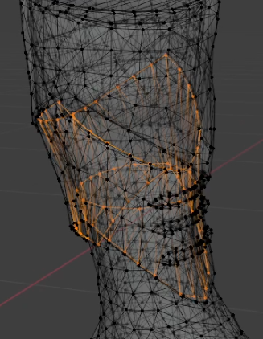

In combination with the `ctrl+l`, `ctrl+i` and `h` shortcuts, this allows you to very quickly select all parts of the mesh that still need your attention and hide all others.

### Face orientation

> Fixing non-manifold by recalculating face orientation: https://youtu.be/DDzGjyC__e8

Remember that you activated the "face orientation" viewport overlay earlier.
Sometimes all it takes to make a mesh manifold is to recalculate the mesh normals.
The action is `Mesh > Normals > Recalculate Outside` or just `Shift+N`.

You can do this once now before you start working on the actual cleanup by selecting all objects and entering edit mode.
This will likely already remove a lot of the red surface from your mesh.

But most importantly:
whenever you made a change to the mesh that closes an object and you have the feeling that the outside calculation should now be working fine again, you should once again run this action and you will see that the colors correct themselves.

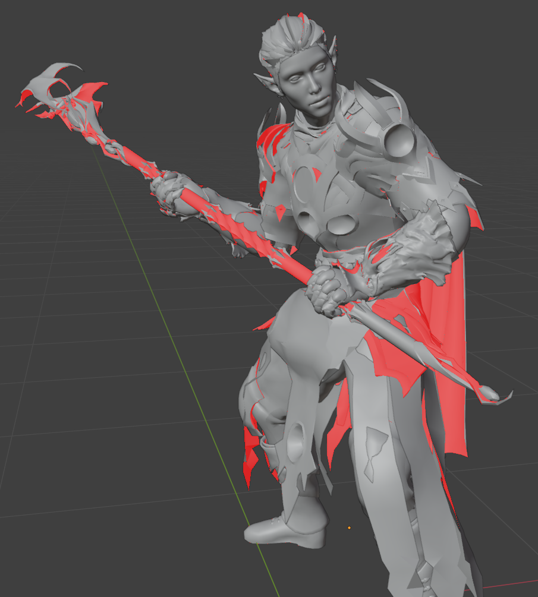

### Closing objects

Since the main objective is to fill the missing faces of the objects on your character, we should discuss multiple ways you can do so quickly.

#### Face filling and triangulation

- You can insert faces by selecting three or more vertices at once (`shift`) and pressing `f`.
- If you select a single vertex and press `f`, Blender will attempt to find neighboring vertices and fill a triangular face between them, which works well on flat meshes.
- If you select two vertices and press `f`, it will fill a quad to the next to.
- If you hold `alt` and click on an edge, it will attempt to select all vertices in the edge loop.
  You can then press `f` and fill the entire loop at once.
- If you have a face that is not a tri or a quad, you should triangulate the face by selecting it and pressing `ctrl+t`.

> Examples: https://youtu.be/xbxgMpQY6uY (all techniques shown), https://youtu.be/wC2IYVu5dPI (filling inner faces quickly)

#### Use Non-Manifold selection

Since a property open geometry is that it is non-manifold, you can often very easily select these vertices using the action/shortcut named above, press `f` and `ctrl+t` and you are done.

> Using non-manifold selection: https://youtu.be/2jvjCddpQF0

#### Bridge edge loops

You can also use the `Bridge > Bridge Edge Loops` action to fill two related opposed edge loops.
Just watch the video below, it's easier to explain this way.

> Shoes: https://youtu.be/T8iPffmihRQ

In general:
Be aware that you might not always want to close objects in these ways!
I will reference this later when you might want to select a different approach.

### Scaling and Solidifying

Depending on your hardware, 3D printer settings and printing size, the print resolution may be limited.
Objects may not be large enough to be visible on the print, or are connected via bridges that are too small to actually be printed.
We use the following ways to fix this.

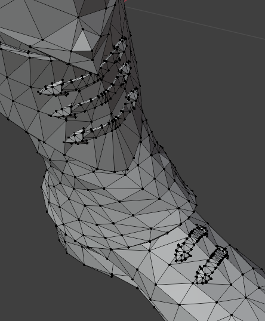
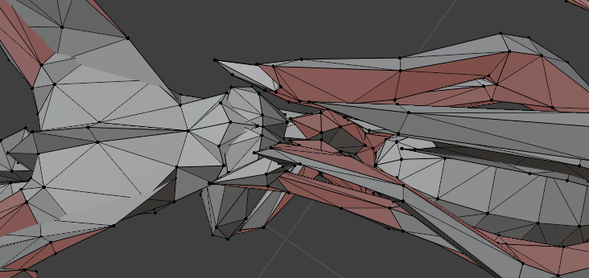

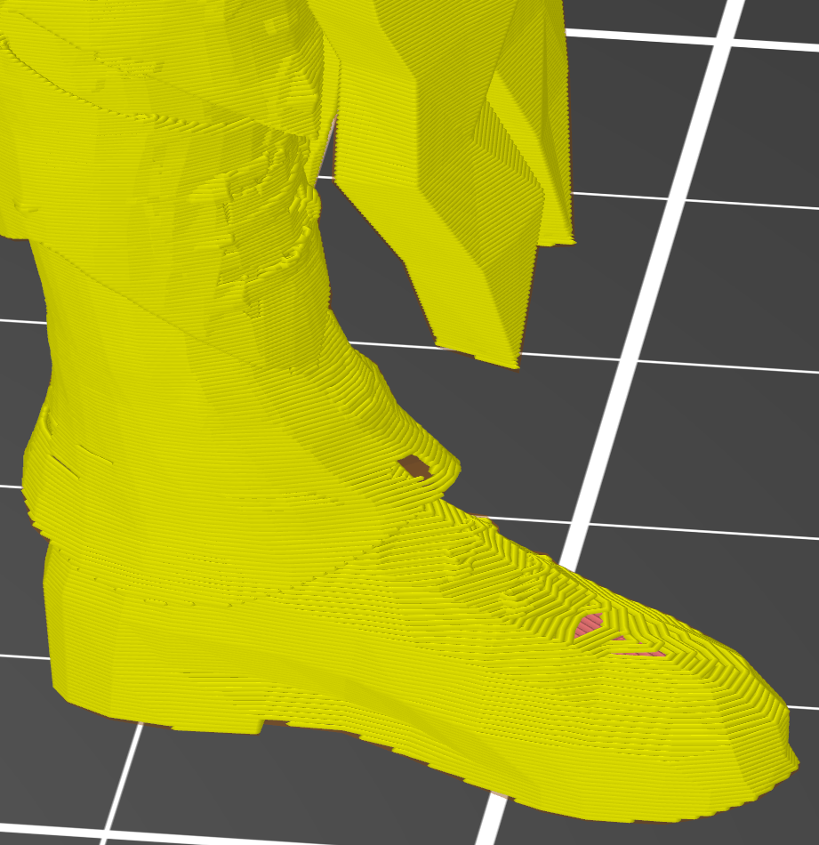

#### Regular scaling (`s`)

You can obviously simply scale an object using `s`, and filter for dimensions using `xyz`.
Always remember that you can switch the `Transform Orientation > Normal` to use a more relevant coordinate system for transformations to your mesh segments.
You don't have to switch back to global to get its coordinate system, simply hit `xyz` twice and you will get the global alignment lines.

When scaling, it might also be interesting to set the `Transform Pivot Point > Individual Origins` since you can scale multiple islands or objects at once as if you scaled them individually.

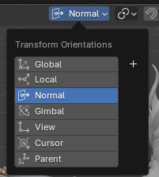
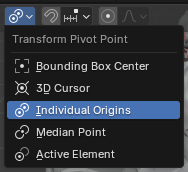

#### Proportional scaling (`alt+s`)

You can press `alt+s` to scale along the normals of your mesh.
Good for thickening objects in all directions proportionally.

You should use this on small bridges in your mesh, like the legs, and horns of the creature on the staff of the image above, but also on thin parts of the mesh like clothing and armor.

> Here are two examples for this: https://youtu.be/qRBrq-bey44 (general use), https://youtu.be/_n7-2iu2wSE (cloth)

Here are two more before-after images:

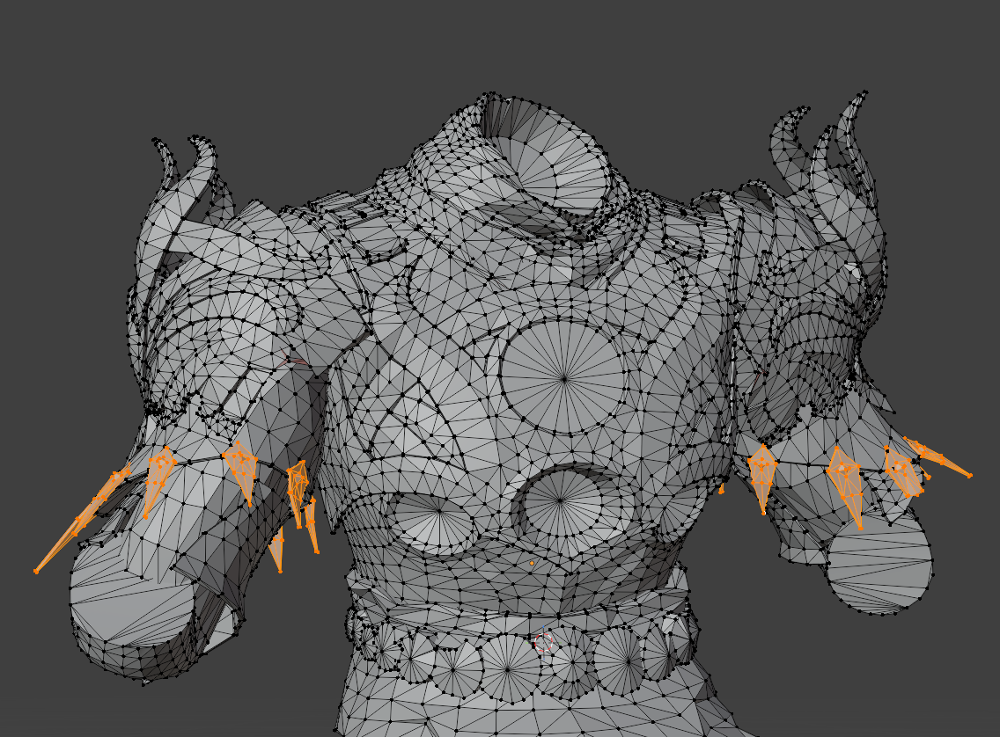
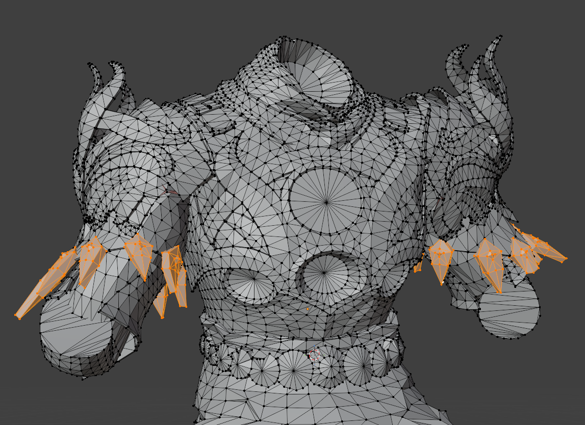

#### Extrude along normals (`alt+e`)

This is the part where I reference the previous chapter.
Because if you use `s` or `alt+s`, sometimes in order to make a part of an object visible enough for printing it also distorts it visually too much such that it does not look good any more.
For this reason, you might want to consider the following situation:

You have a non-manifold "broken" mesh that is a plane with no thickness or you can easily get to this situation by removing one or two edge loops.
In this case, you can select all vertices of the mesh and use `alt+e` to `Extrude > Extrude Faces Along Normals`.

After you have solidified the object with that, you can still scale it using any of the operations above.

> Examples: https://youtu.be/dK3EQI8BgZw (shoelaces), https://youtu.be/5lmI7rAC3vg (spikes, I would extrude them even further than that and scale them along normals a bunch)

### Solidify modifier

> An example: https://youtu.be/W7lXes3Wpsc

Even though this fits somewhere in the previous chapters, I will make it its own, because there are a few more things I want to say.
I like working with modifiers whenever I can, since they are non-destructive meaning you can change their values any time, and they are applied to the mesh when exported automatically.

The solidify modifier works great on zero-width planes (no thickness) to make them a manifold solid.
The result will be very similar to the `Extrude > Extrude Faces Along Normals` action, but you can change it at any time with no extra effort.
Since you won't apply the result, Blender will still highlight the vertices as non-manifold but that is fine, as the export to `.stl` will apply the modifiers.

You cannot apply this modifier to only a selection of your object, so you might want to split the object into multiple (`Mesh > Separate > Selection`).

The modifier will use the face normals to determine the direction in which to extend the mesh outwards.
You might have to select an island (`ctrl+l`) and invert face normals (`Mesh > Normals > Flip`) to get it to go in the right direction.

You can play around with the settings of the modifier, like the thickness or offset, but for later the `Edge Data > Crease Inner / Outer` (`~0.9`) might become relevant when we smoothen out the object.

## Cleanup

Now let's get started with actually fixing the model.
Exporting an `.stl` file now and slicing it in your slicer software will reveal many different problems, such as layers or entire objects missing.
Our goal is to get it to look as it does on the right side.

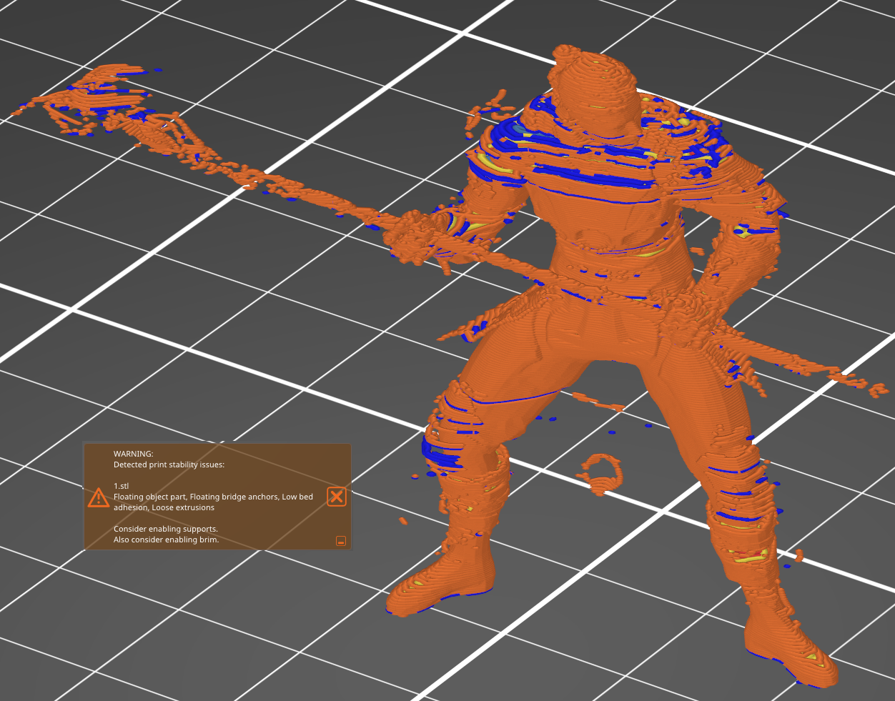
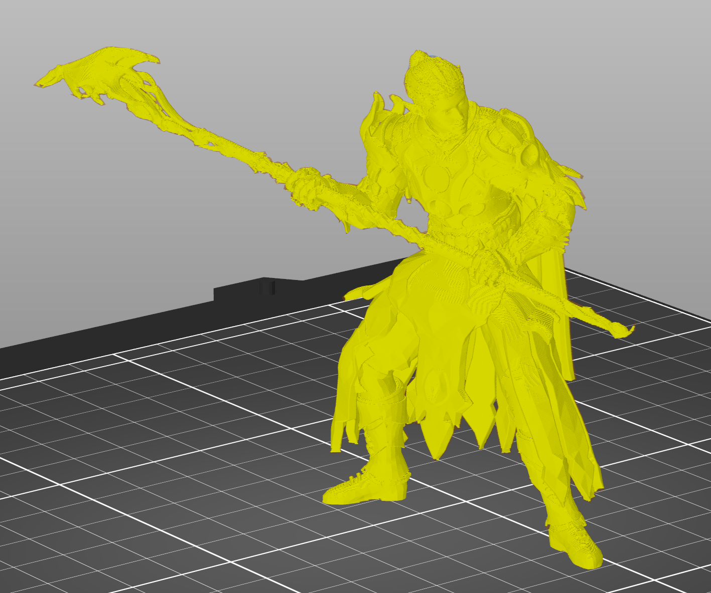

This model preparation will take place in three phases, each with a chapter below.

I like to perform the first two phases separately, as it allows me to first fix the basic errors of the mesh and then later adjust the style of the object in one go to my liking.
You can perform them at once if you prefer.

There are a few objects representing special cases, such as the shoes, cape and hair which will be covered in more detail in a chapter below.

## Cleanup Phase 1: Geometry Repair

Every single step in this process is to be performed on every object individually.
When you are done with one object, you can move on to the next object and repeat.

You will always want to start by doing the following:

- Select the object and use `num+/` to focus the object of interest.
- Enter edit mode (`tab`).
- Select all non-manifold geometry.
  These are the parts we want to repair.

The previous chapters detailed methods for how to deal with the different szenarios you can encounter.

Recordings are provided with the process in Blender for several parts of the model:

- Shoes: https://youtu.be/Y9rWQLaYgeI
  - The shoes are a great example, because they show a bunch of different cases.
  - To make it even faster: Removing the edge loops on the shoelaces could have been done with selecting all non-manifold.
- Legs: https://youtu.be/BK_MWbFieIM
- Torso: https://youtu.be/G6v_mSu6Fag
  - This one is not as elegantly recoded as the others and the technique is not as refined, I'm sorry.
    It still shows some good special cases.
  - Similarly to the shoelaces (why do they keep coming up?), instead of using `alt+s` to make the studs on the belt thicker, I should have removed the outer edge loops and made them more cylindrical (increase depth) by extruding along normals (`alt+e`).
    Then you can move them outwards to make them stand out more in the print.

I will be covering the cape and hair later, so skip those for now.

I'll list some of the szenarios here still, but keep in mind that every situation is different.

<table>
  <tr>
    <td>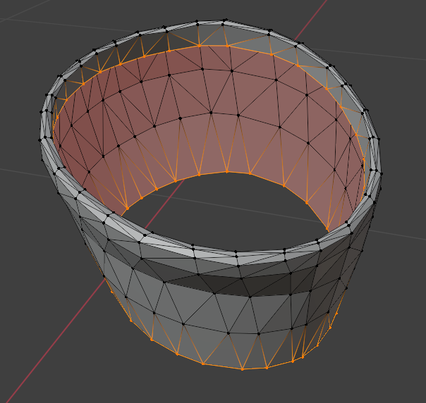</td>
    <td>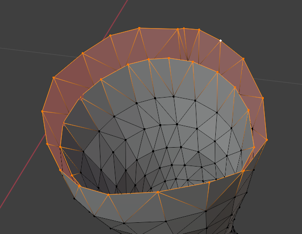</td>
  </tr>
  <tr>
    <td>Simply fill edge loop with face and triangulate faces.</td>
    <td>Bridge edge loops.</td>
  </tr>
  <tr>
    <td>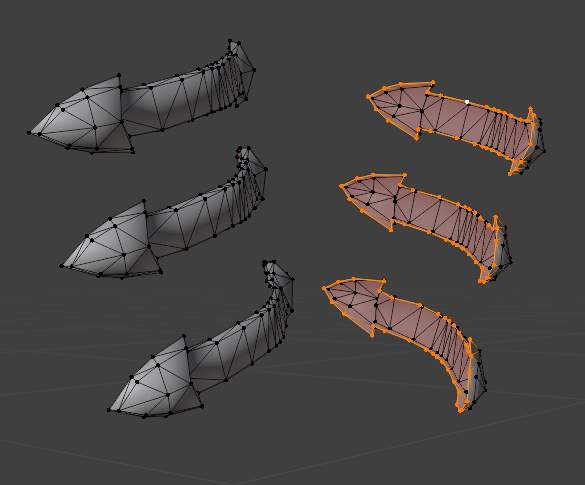</td>
    <td>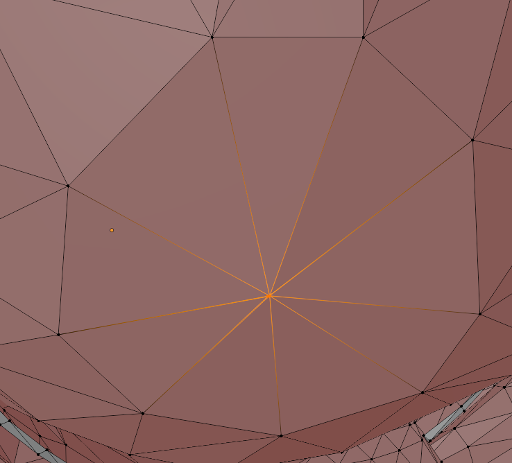</td>
  </tr>
  <tr>
    <td>(close to) plane zero-width-face: remove edge loops to make truly flat and extrude along normals.</td>
    <td>Overlaying vertices: Merge at center.</td>
  </tr>
  <tr>
    <td>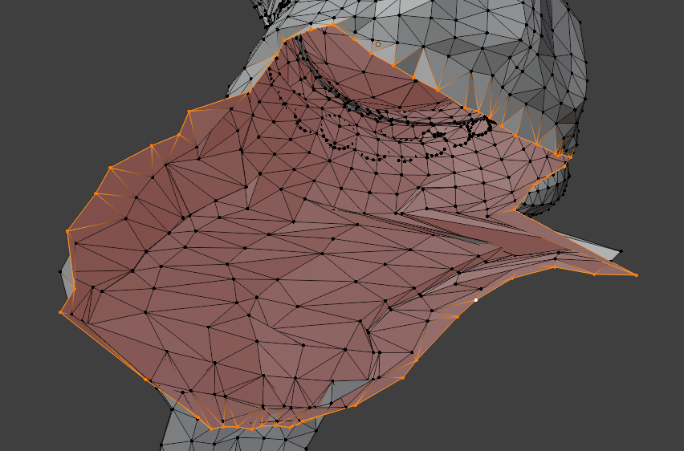</td>
    <td>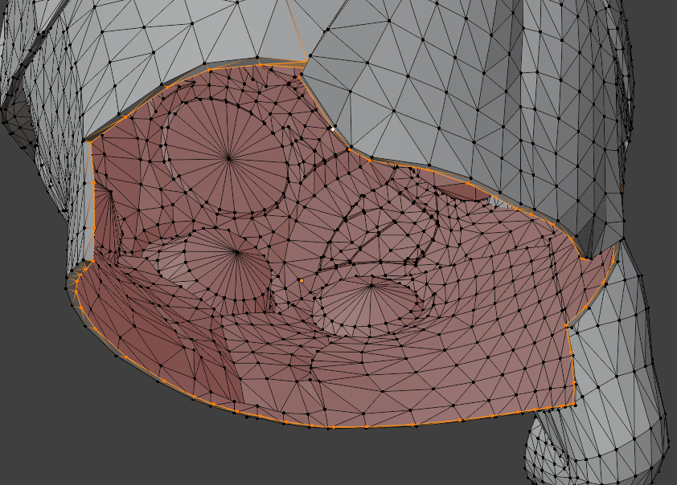</td>
  </tr>
  <tr>
    <td>If you have a more complex edge loop on the inside of the object, it does not really matter since you will not see it from the outside. Just close the loop with a face.</td>
    <td>Sadly it might be more complicated to close the shapes, as the normal algorithm will not properly triangulate the faces on multi-sided edge loops. You'll have to create individual faces manually.</td>
  </tr>
  <tr>
    <td>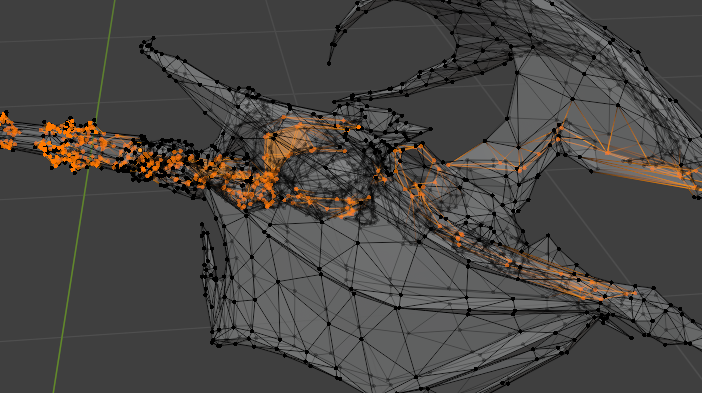</td>
    <td>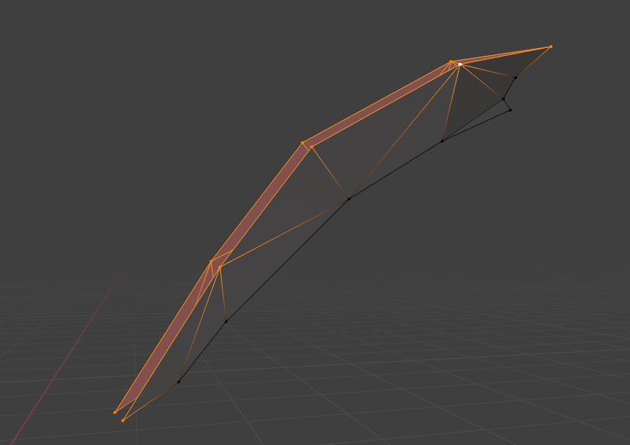</td>
  </tr>
  <tr>
    <td>Certain elements might look daunting at first...</td>
    <td>...but focusing on the individual elements that are broken might reveal that it is in fact very simple to repair them. Here for example a simple <code>alt+click</code> to select the edge loop and inserting a face (<code>f</code>) that you then triangulate (<code>ctrl+t</code>) will do the trick. Repeat several times.</td>
  </tr>
</table>

I'm sure there are plenty more, just view the videos above showing full examples or work them out for yourself.
In the end, your mesh should not have any more vertices highlighted aside from the ones with a solidify modifier and the hair.

## Cleanup Phase 2: Structural/Aesthetic Adaptation

Now that the model is _theoretically_ printable, we will have to make some more adjustments to make it look properly.

Basically, whenever you have a small detail anywhere, or a loose element like a strap or a buckle, you need to exaggerate its size.
If a leather strap is flat against the skin in the game, it might not show up at all on a print.
If a weapon has a thin edge, it will fail to print or snap off immediately.

For this, the techniques in [General Practices: Scaling](#intermission-general-practices) are relevant.

- You may use `s` or `alt+s` to make elements larger.
- Make the mesh of small parts deeper and pull them out of the model to expose them more.

Now, let's look at the specific problem areas that almost every character model has.

### Filling cylinders

Even though it might not immediately be obvious, all clothing, shoes and armor or shoulder pieces that wrap around the body of the character are likely not filled entirely and rather form hollow cylinders.
This makes it harder to print, as there will be the body piece like an arm of the character on the inside, a tiny spacing of air all around the arm and then the armor above that.
Our goal is to identify and seal these gaps.

I propose two methods of doing so.

- Either, you can simply take all the inner vertices, scale them to a single point (`s+0`) and merge them.
  You may move them to a point in space where the connecting faces are perpendicular to the surrounding armor/clothing piece.
  This works well for parts that are not fully closed.
  - An example of this: https://youtu.be/r7fA2_o6JIg
- Or, a more involved method is to remove all the inner vertices of the cylinder mesh and to close the upper and lower edge loops with a face.
  - This example shows this for a cylinder that is open to it's side. It's usually easier if the model is not open like this: https://youtu.be/G9I1n4ZIX4A

Of course, you can adapt or mix these with your own for any situation.

### Cape

> Full process with solidification of the cape (starts at 50s): https://youtu.be/8Y6-mPcH2eg

Capes in BG3 have the property that they consist of a flat plane, except at the borders where they are solid and have two layers.
The image below shows this, where the edges have front- and back-facing faces and the center faces are exposed to both sides:

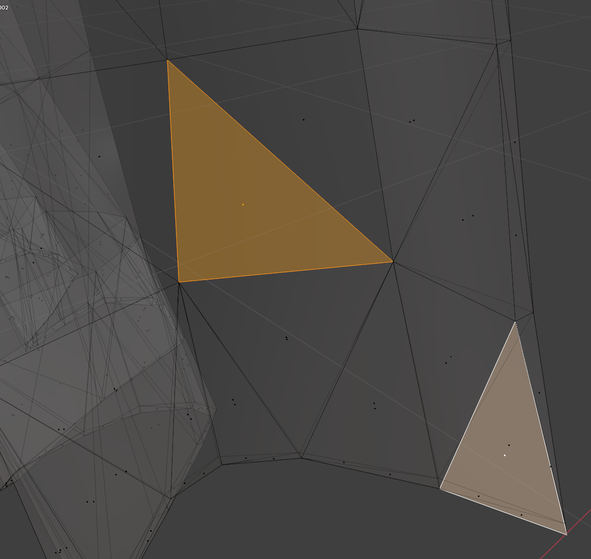

I really recommend watching the video above, it will make so much more sense.
But here is a textual description with all the keybindings:

- We select the full edge loop on the inside of the cape with the goal of removing the inwards facing vertices and faces.
  - Select a first vertex, then `ctrl+click` on one a bit further away to select the shortest way between them.
  - Repeat this until you have selected the full edge loop.
  - Remove the selected vertices.
  - Restore any broken geometry.
- Depending on the cape in the game, the top part might have a larger segment with a two-sided mesh.
  We want to remove the inside part from this too.
  - Select one vertex or an entire row on the top.
  - Press `num+"+"` to expand your selection to include all those vertices and add the rest manually (`shift/ctrl`).
  - Remove the vertices.
- Apply a Solidify modifier with a thickness of your choosing.

### Hair

Game hair is usually made of flat strips of geometry with semi-transparent textures to look like strands.
We cannot print transparency, and we cannot print flat cards.

My preferred workflow for this is:

- Select the hair object.
- Add a Solidify modifier with a thickness you have to chose yourself (I picked something around `0.012 m`).
  You want the strips to expand until they touch each other, creating a solid mass rather than individual ribbons.
- Add a Decimate modifier to simplify the geometry again.
  I picked `0.5` for the decimate ratio.

This process will result in broken geometry pretty much no matter what you started out with.
I never had any problems with this, as there were enough arbitrary objects in there that caused the slicer to create a surface.

However, if the geometry is too broken add a Remesh > Voxel modifier.
Set the voxel size to a very low value (e.g. `0.005 m`) but not too low for your Blender to crash.

...you can also add a sphere or other shape manually to the mesh to fill in holes.
Just saying.

### Shoes and feet

> An example: https://youtu.be/0Nj2wjYYJkY

Since BG3 uses inverse kinematics for the feet, the character is likely not standing fully flat on the X/Y-plane.
We need to make sure that the feet are flat on the ground however, since it will otherwise not stand properly when printed.

- Enter side view with `alt+mousewheel+drag` or by clicking the RGB 3D Axis symbol in the top right.
- Select all objects (`a`).
- Move the character down until the feet are _almost_ flat against the green/red axis line (`g+z`).
- Repeat for both shoes:
  - Zoom in very close to the bottom of the shoe, where it touches the ground.
  - Enter edit mode (`tab`) and turn on X-Ray mode (`alt+z`).
  - Select all the vertices that form the underside of the shoe.
  - Scale them vertically to 0 (`s+z+0`) to flatten them.
  - Optionally turn on proportional editing with connected geometry.
    Pick a fitting scale.
  - Move the vertices down to the ground.
  - Move vertices manually where they don't look round or good in general anymore.

> Tieflings already have an additional resting support (lol).

## Cleanup Phase 3: Smoothing

> This is one of the last steps we will be performing in Blender.
> These are destructive actions, so now is the time to save your progress and save over a new file to ensure your work is not lost.
> Now is also a good time to check the thicknesses, etc. again.

Game models are "low poly", since they use normal maps and smooth shading to appear like they have a higher resolution.
This means, you can see the sharp edges of the polygons on curved surfaces like skin or clothing.

We want the print to look smooth.
For this, we will mainly be utilizing the `Subdivision Surface` modifier.
However, the definition of what smooth means might differ from object to object.
For example, you do not want to have the blade of a sword or the sharp edge of your shield to be rounded.

We need to tell Blender which edges to keep sharp.
This is where "Edge Creasing" comes into play.
For every object in the scene that you want to have smoothed, perform the following actions:

1. Select Sharp Edges
  - Select the object and enter edit mode (`tab`).
  - `Select > Select Sharp Edges`.
  - Adjust the angle threshold (usually around 25°-70° depending on the object) until it selects all the hard corners but leaves the curved surfaces unselected.
2. Apply Crease
  - In the top right sidebar (`n`), set `Item > Transform > Edges Data > Mean Crease` to a value between `0.8` to `1.0` depending on what kind of style you want.
3. Subdivide
  - Go to Modifiers and add a Subdivision Surface modifier.
  - Set viewport and rendered levels to 1, 2 or 3.

The armor plates should stay sharp, but the curved surfaces between them should be smoothed out.
If you realize that the mesh is still too flat in some places, you can pull them out to force a sharp edge.

> Here is an example where I go over several objects in the scene: https://youtu.be/_NiRAaBzoGg  
> Please keep in mind that I changed a bunch more after this, adjusted the values and crease further.
> This is an iterative process.

---

Your model should now be ready for printing.
Observing the model in the slicer will reveal additional things you have to change in the model, this happened to me a lot.
