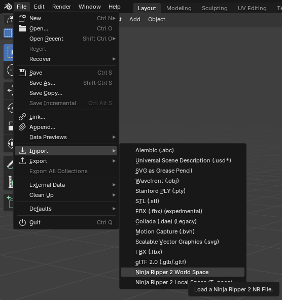
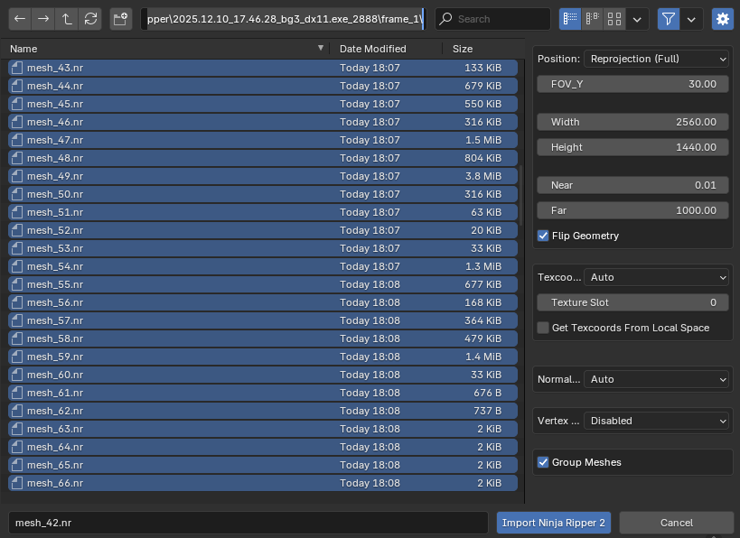
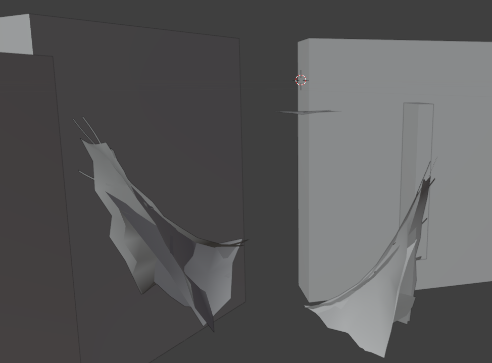
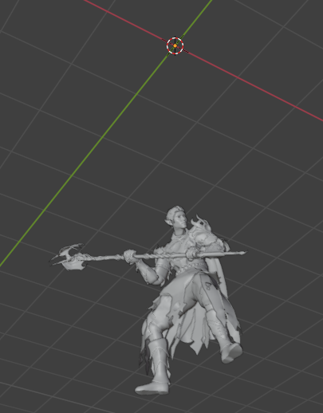

# Chapter 2: Print preparation in Blender

[< Model Extraction](ripper.md) &bullet; [Main Page](readme.md) &bullet; [Blender Cleanup >](blender-cleanup.md)

## Installing NinjaRipper Import Plugin

In the installation directory of NinjaRipper ([see installation guide here](ripper.md#installing-ninjaripper), e.g. `C:\Program Files (x86)\Ninja Ripper 2.8\bin64\importers`), you can find a file `io_import_nr.zip` that you can import into blender as a plugin (Preferences > Add-ons > Install).

- Video showing installation process of the plugin: https://www.youtube.com/watch?v=gl9wlEz82ho
- How to import mesh files (NinjaRipper homepage) (process is detailed in the chapters below):  
  https://www.ninjaripper.com/faq#how-do-i-import-files

## Importing the model

A new option in the `Import` setting should appear: `Ninja Ripper 2 World Space`

Navigate to the extracted mesh directory specified: `%APPDATA%\Ninja Ripper\<game-dir>\<frame-dir>`

There should be a few hundreds of `.nr` files.
Since importing them all at once may not only lead to very long loading times but also to crashing the program, we will only select the first 100-200 files (click on the first, scroll down, hold shift, click on the last you want to select).
With each attempt of finding the character model, select the next batch of 100-200 files.

Import settings:

- Position: `Reprojection (Full)`
- FOV_Y: `30` (this is the FOV you configured in the camera mode)
- Width / Height: The size of the screen you had Baldur's Gate 3 running on when running the extraction (e.g. `2560` x `1440` px)
- Flip Geometry: Checked

Finally, click on `Import Ninja Ripper 2`.

The import may take a while.

If your scene does not contain all your character meshes as seen on the following image, try the next batch of files.

If you were casting a spell, a box representing the graphical effect might surround your character.
Just delete it alongside the other objects.

Since the photo mode camera in game becomes the origin of the scene in blender, depending on where you positioned the camera, your character might be slightly further below or closer to the scene origin.

Simply move the model upwards until the feet are flush with the X/Y plane (`g+z`) and use the `Origin to Geometry` action to properly move the origins which will make it easier to work with later.

---

[< Model Extraction](ripper.md) &bullet; [Main Page](readme.md) &bullet; [Blender Cleanup >](blender-cleanup.md)
