# Chapter 5: Painting the Printed Figurine

[< 3D Printing](printing.md) &bullet; [Main Page](readme.md)

Taking the time to paint your printed figurine is the final step that brings your digital character into the physical world that can be very rewarding, but also requires patience and can take several hours depending on the complexity of your character.

This chapter reflects my personal experience as someone who had never painted a 3D model of this scale and amount of detail before this project.
If you are looking for professional techniques, there are many dedicated channels on YouTube or blogs in the internet that can teach you advanced methods like washing and dry brushing.

I recommend practicing on a smaller, less important print first.
I bought a small Warhammer Patrol Unit from a local Warhammer shop to test my brushes and colors to see how the paint behaved before touching the main figurine.

<table>
<tbody>
    <tr>
        <td>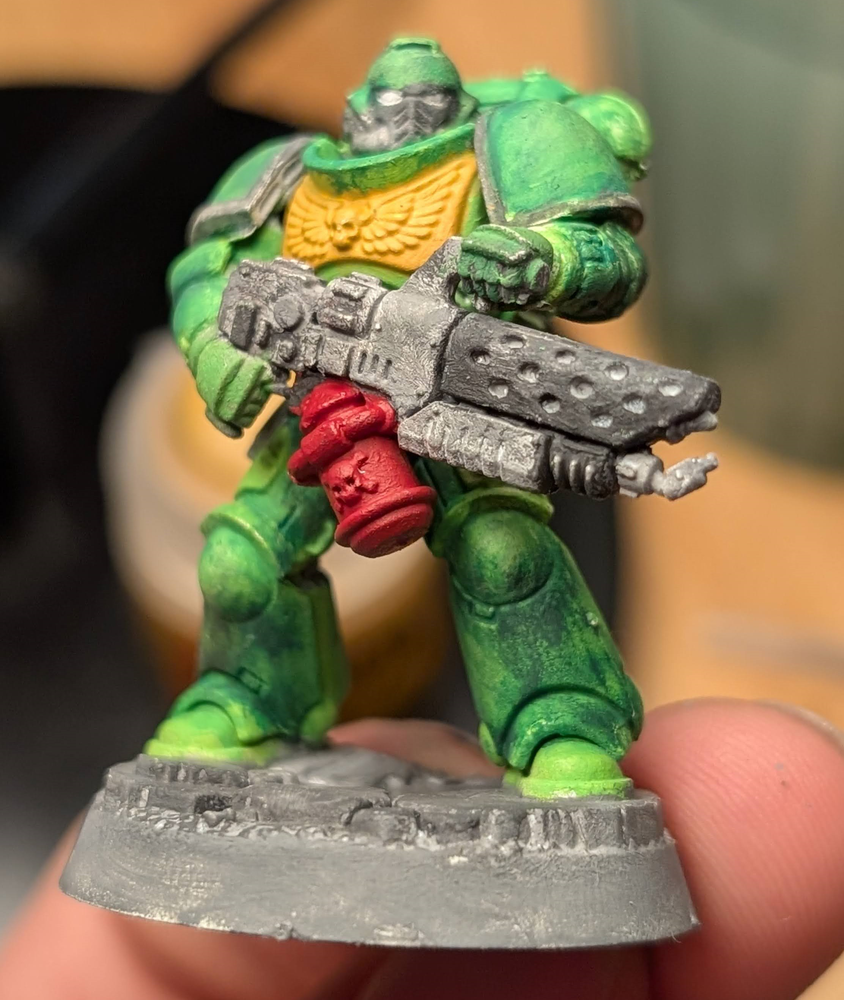</td>
        <td>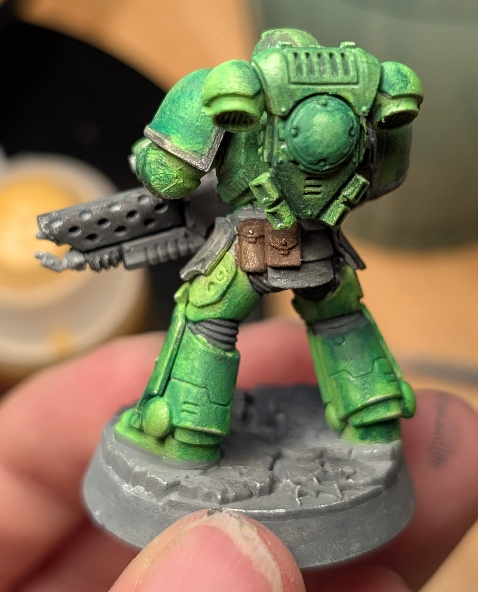</td>
    </tr>
</tbody>
</table>

## Collecting reference images

Reference images are vital for capturing the specific textures and color palette of your character.
I used the screenshot tool within Baldur's Gate 3 by pressing `F9`.
Move your character up into the sky using the slider, and use different pre-configured poses to capture your character from every angle.
I cannot stress enough how important this is if you later want to faithfully recreate the colors and textures.
You can also drop your equipment on the ground to get better angles.
Better take too many close-ups than too few.

Here is my collection of screenshots, which I uploaded into a Google Photos album so that I always have it with me on my phone or tablet when I paint the figurine.

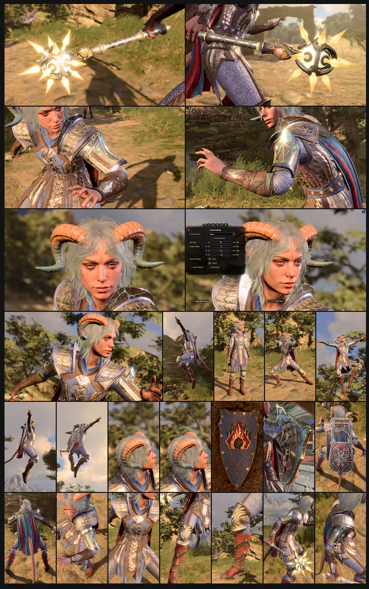

## Materials

Priming the model is an essential first step to ensure the paint adheres properly to the plastic.
I used a basic spray primer from Revell to coat the figure evenly before starting with the brush work.

For the colors, I used a combination of standard acrylics and Citadel miniature paints.
While general acrylics worked really well for me in most cases, I found that paints designed specifically for miniatures, such as Citadel colors, had much better coverage and vibrancy in a single coat.
I also got a metallic gold and metallic silver for the metal details, such as the armor and shield, and some shade and contrast colors for the skin.

You will want a variety of brushes.
A standard size works for base coats, but a very fine brush with just a few bristles is necessary for tiny details like the eyes or the strings on an instrument.

The image below shows a snapshot of the workspace and some of the paints used during the process.

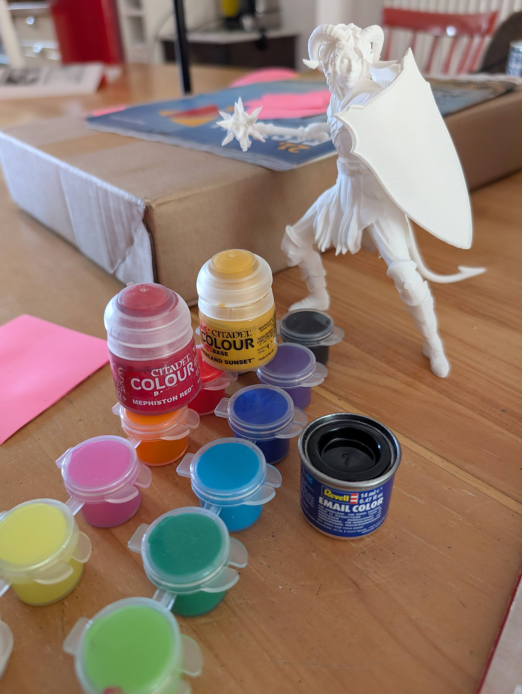

## Process

The order I did things in was to start by applying the base colors to the largest areas first, not minding if the colors spilled over the edges of the surfaces.
Next, I would paint the outlines (like leather or metal) and finally added texture to the currently flat shaded individual surfaces.

Basically, I found it best to work in a way that painting clean edges becomes easier by drawing them later over the existing colors and painting the most detailed areas last.
You are most certainly going to paint over everything multiple times to not only make sure the color is fully opaque, but also enhance the textures and color depth.
You may also decide that some areas would look better in different colors than in the game, and I certainly took a lot of liberties with this on my own.

And last, I worked on the accessories.
The shield and the lute were particularly time-consuming, because of their great detail.
I once again started with the inner colors (blue for the shield, brown for the lute), then the brown/gold outlines and last the details and drawings.

An unexpectedly difficult step was the face, where I used my smallest brush to carefully do the eyes.
Painting realistic eyes is astonishingly hard.

I finished by going back over the model to touch up any areas where the paint had spilled over the lines.

<table>
<tbody>
    <tr>
        <td>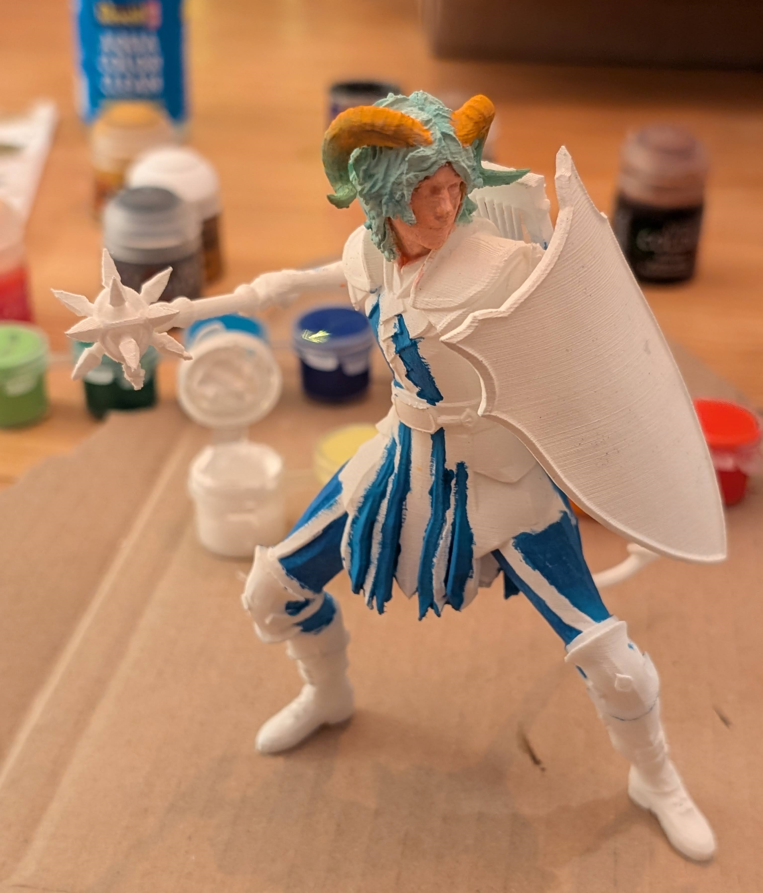</td>
        <td>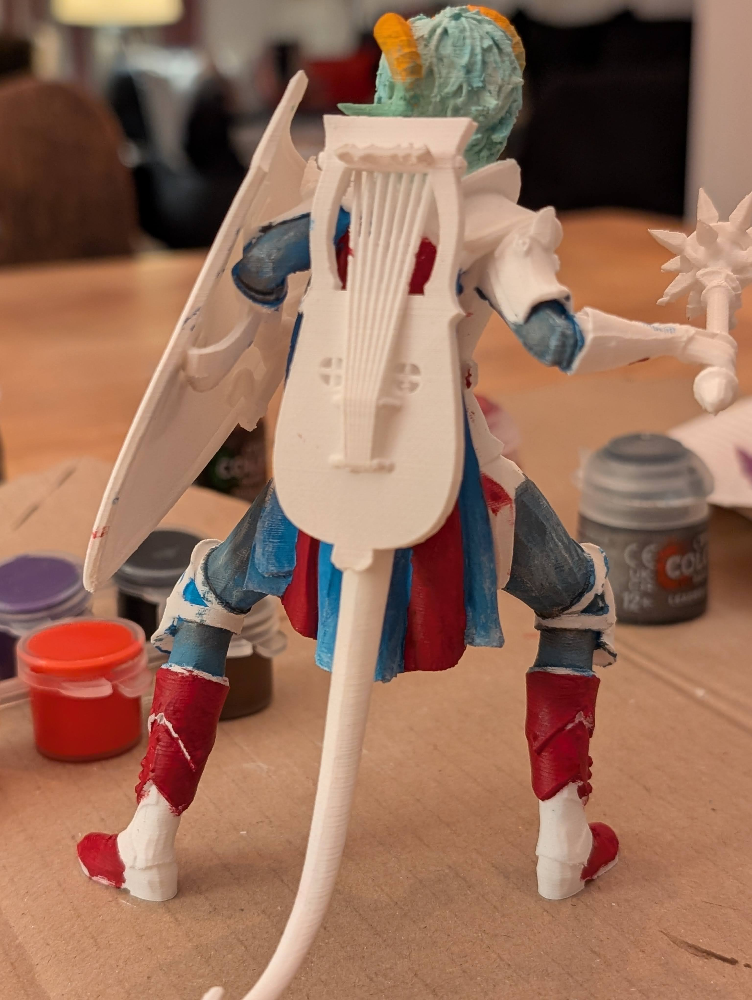</td>
        <td>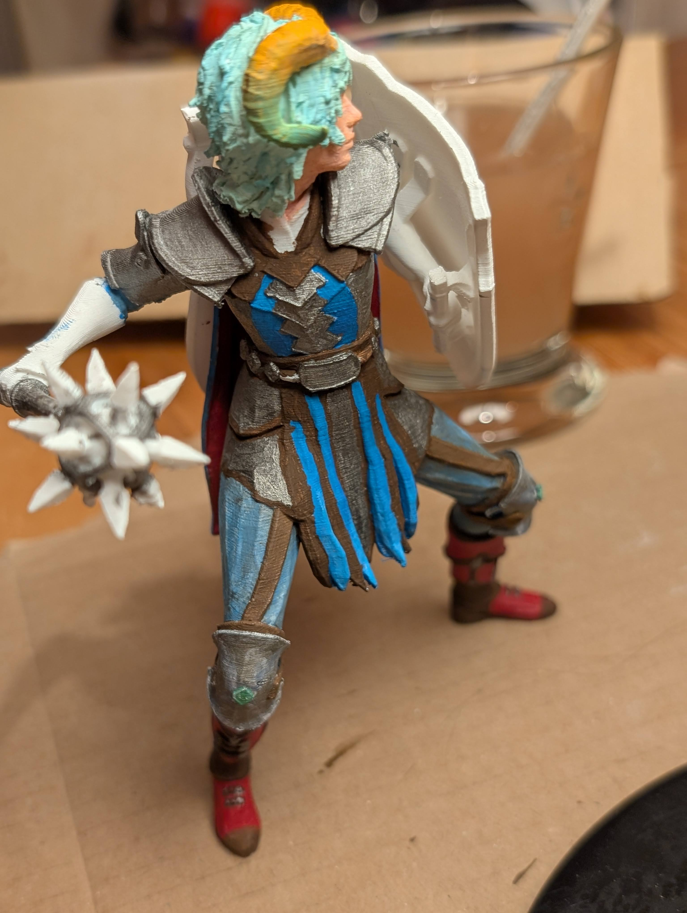</td>
    </tr>
    <tr>
        <td>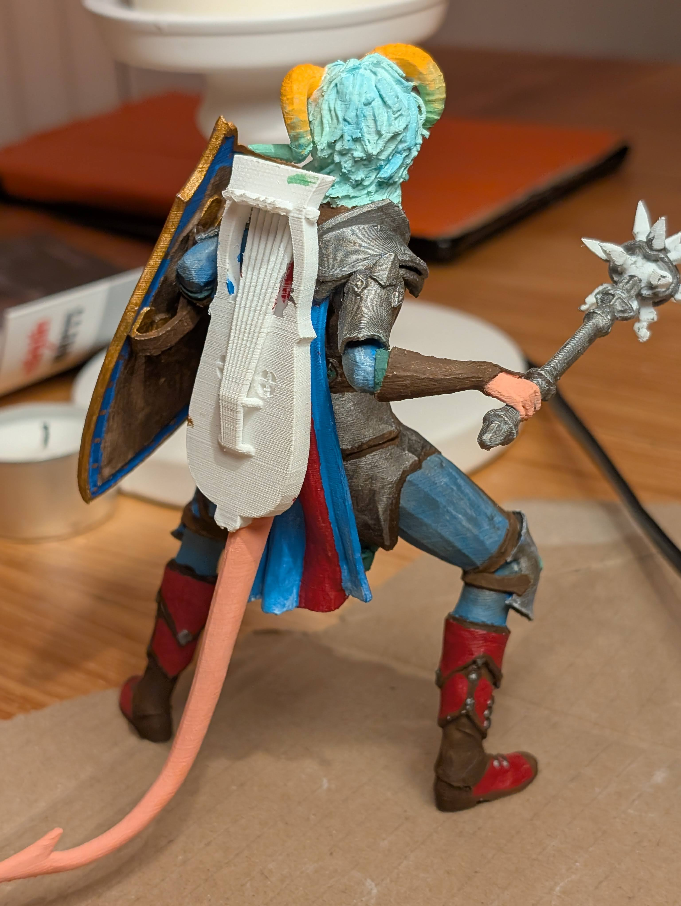</td>
        <td>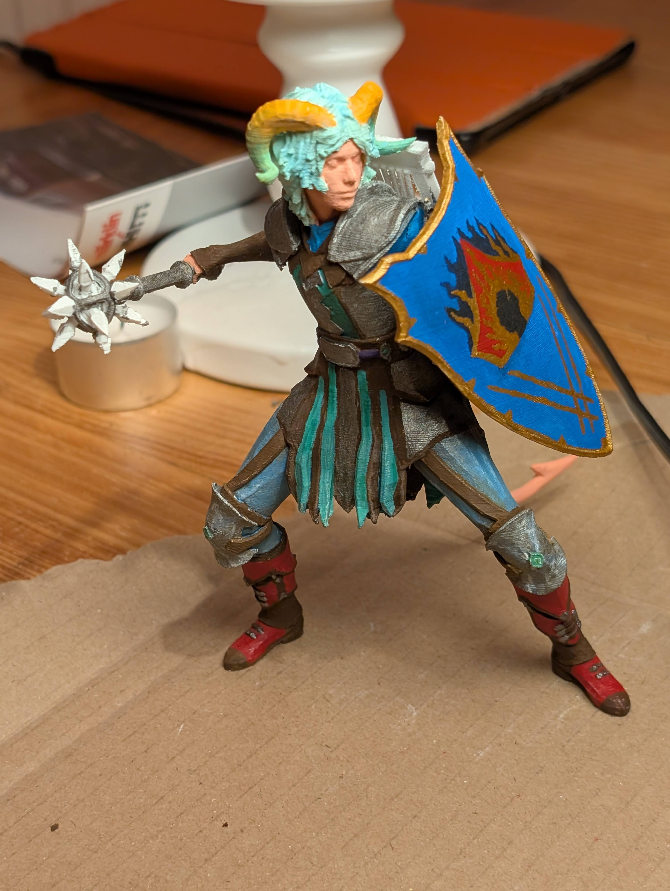</td>
        <td>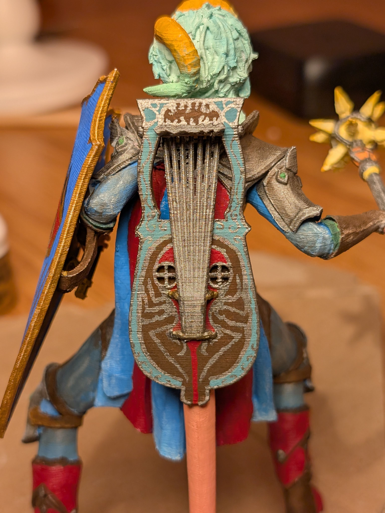</td>
    </tr>
</tbody>
</table>

## Showcase

And now, for a final photoshoot of Ramie the Druid Tiefling of all angles and all accessories!

<table>
<tbody>
    <tr>
        <td></td>
        <td>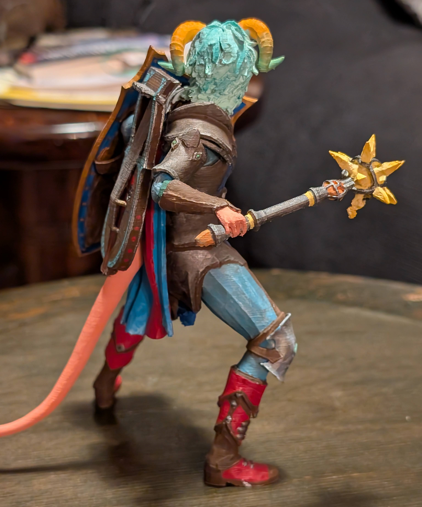</td>
    </tr>
    <tr>
        <td></td>
        <td></td>
    </tr>
    <tr>
        <td>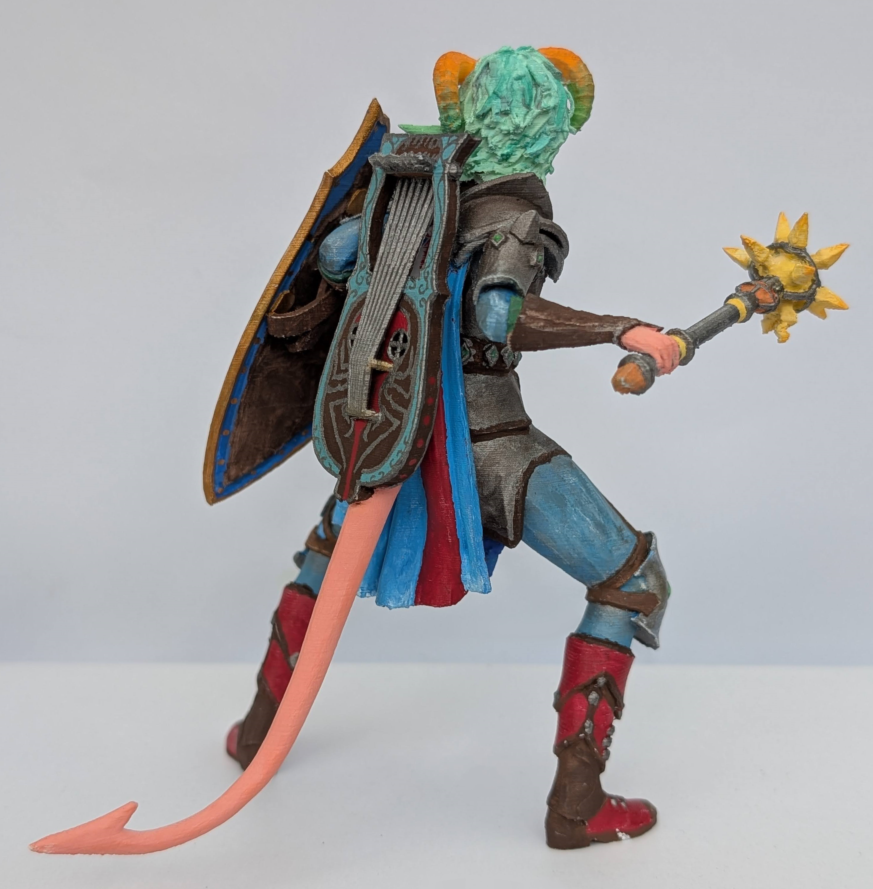</td>
        <td>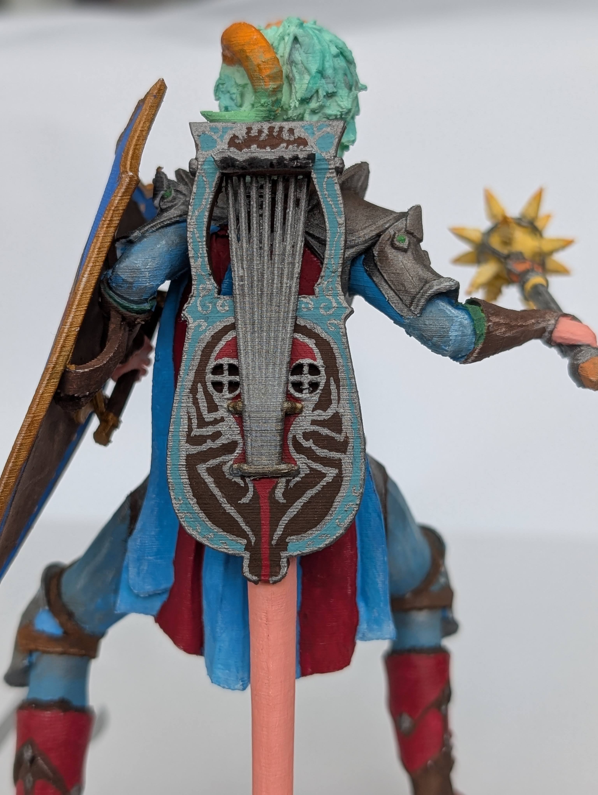</td>
    </tr>
</tbody>
</table>

[< 3D Printing](printing.md) &bullet; [Main Page](readme.md)
