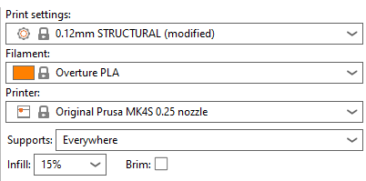
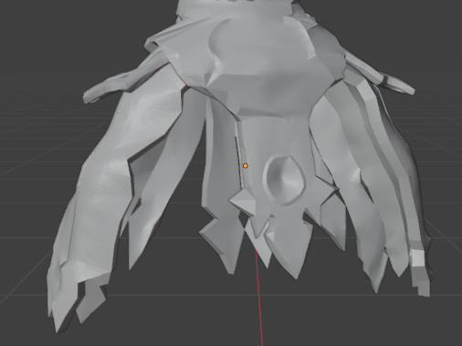
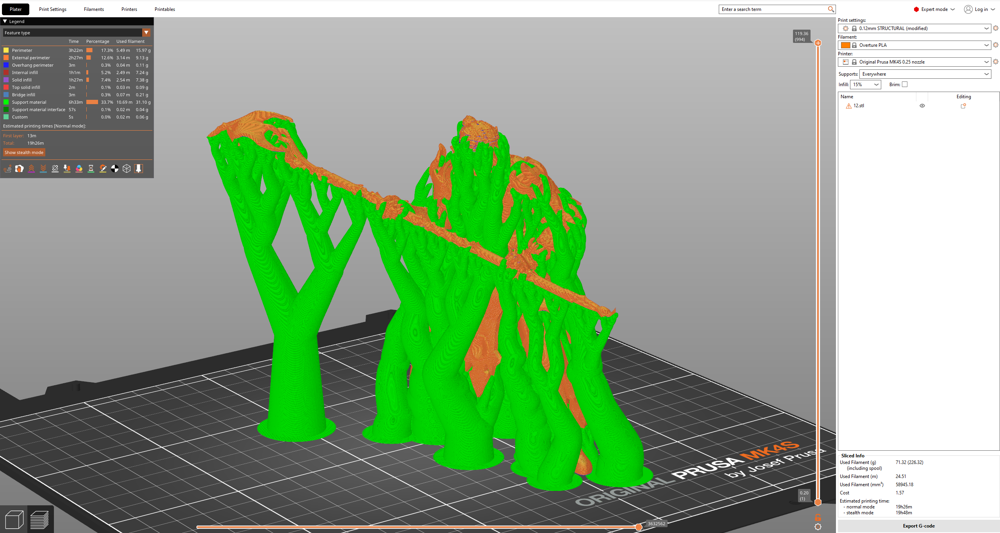

# 3D Printing

We are almost there.
You should now have a collection of objects that are:

- Manifold
- Thickened for durability
- Smoothed for aesthetics

## Export

Use the `File > Export > Stl (.stl)` option to export the model into an `stl` file.
Ensure that you uncheck the option `Selection Only`.

## Model checkup

Now is the time to validate that your model is valid for printing.
If you can see:

- any missing layers or are you missing entire objects:
  - This is likely because an object in your model still has non-manifold geometry.
- any connections between parts of the model that are only 1-2 layers thick:
  - Ensure you scale the objects connecting each other large enough.
  - Add additional geometry.
- missing detail:
  - Ensure that you extrude and scale all small objects large enough for the slicer to generate material for it.

Use your own understanding of 3D printing and search for other errors.

## Print settings

I printed my model using a [Prusa MK.4](https://www.prusa3d.com/de/produkt/original-prusa-mk4s-3d-drucker-5/) with the [PrusaSlicer](https://www.prusa3d.com/page/prusaslicer_424/) software.

These are the settings I used to get a high resolution print.
It took ~20h to print a 13.5cm high figurine.
I chose organic support for my model.

On both characters I printed, I never had any issues printing them, aside from the following:
The tips of the dress were never properly started by the printer.
It appeared as if they were printed in the air or broke off?
I had to often trim the bottom few millimeters where the broken print was noodling away.

## Printing

Well, and then it is time to print the model.

I'm actually still waiting for the printer to finish.
I will update this later.
