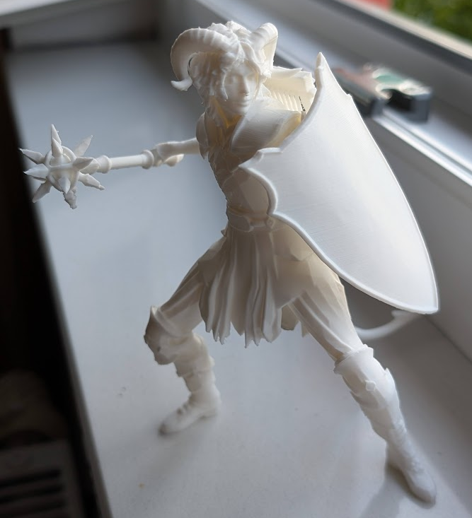
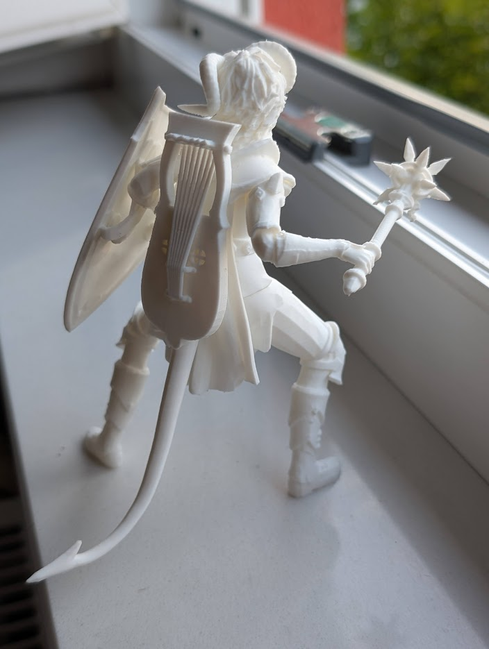

# 3D Printing BG3 Minifigures

Work in progress.
Only tested for Windows 10.

This guide will assume that you have Baldur's Gate 3 and Blender installed.
Further, basic knowledge of using Blender is expected.

If you do print the model by yourself at home, you will also need a 3D printer, and it's slicing software.

You should be warned that following this guide through to a printed model is neither easy nor quick.
Figuring out these steps took me well over 20 hours the first time, I will update this how long it takes me on my second go when I'm done with it.

## Obtaining the 3D Model

[ripper.md](ripper.md)

## Print preparation in Blender

- [blender-import.md](blender-import.md)
- [blender-cleanup.md](blender-cleanup.md)

## Printing the model

[printing.md](printing.md)

## Further info

- Save file location: `%localappdata%\Larian Studios\Baldur's Gate 3\PlayerProfiles\Public\Savegames\Story`
- Extracted model dir: `%APPDATA%\Ninja Ripper`
