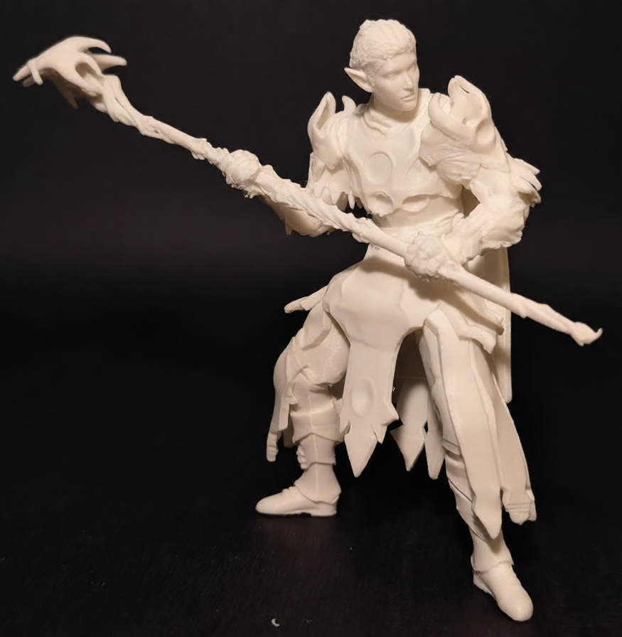
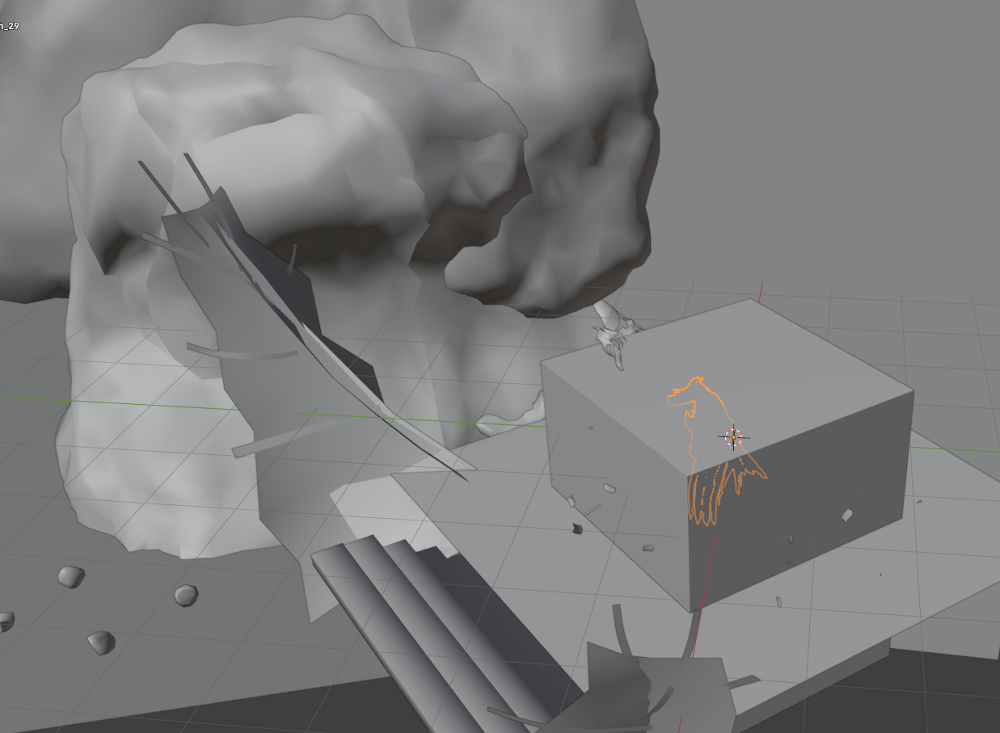

# Guide: 3D Print a Custom Baldur's Gate 3 Character

This repository contains a guide for extracting custom character models (including equipment and pose) from Baldur's Gate 3, converting the geometry into manifold meshes, and preparing them for 3D printing.

Users should be advised that the transition from a game asset to a printable object involves significant manual labor during the repair phase.
My initial attempts required 10+ hours of cleanup; my second attempts reduced this to 3 and I'm sure I could do it even faster now.

<table>
<tbody>
    <tr>
        <td></td>
        <td></td>
    </tr>
</tbody>
</table>

#### Disclaimer

This guide is intended for personal use and educational purposes only.
All game assets remain the intellectual property of Larian Studios.
Do not redistribute extracted 3D files or sell prints derived from game assets.

This guide was created as personal research notes while I was figuring out how to print my characters.
Feel free to adapt and modify any steps you have more knowledge or other ideas in.
And please, open up an issue with your printed models if you end up using this guide, I'd love to see them!

## Prerequisites

Execution of this guide requires the following software and hardware.

- Windows PC
- Baldur's Gate 3 (Larian Studios)
- Ninja Ripper (covered in this tutorial, or bring your own equivalent tool)
- Blender 3.0 or higher
- 3D Printer
- Slicing Software (PrusaSlicer, Cura, Chitubox, Lychee, etc.)

## Guide Phases

Follow the documentation in the specific order listed below.

|                                                                                                                                       | Phase                                 | Description                                                                                     |
|---------------------------------------------------------------------------------------------------------------------------------------|:--------------------------------------|:------------------------------------------------------------------------------------------------|
|                             | [Model Extraction](ripper.md)         | Inject an extraction tool into the running BG3 process to capture player character geometry.    |
|                  | [Blender Import](blender-import.md)   | Import the raw mesh data into Blender, cleaning the model, and organizing the mesh islands.     |
|  | [Blender Cleanup](blender-cleanup.md) | The core manual process of non-manifold repair, thickening surfaces, smoothening and remeshing. |
|                             | [3D Printing](printing.md)            | Slicing the model and printing it on a 3D printer.                                              |

## Reference Directories

Use these paths to locate necessary files on your system.

- BG3 Save Files: `%localappdata%\Larian Studios\Baldur's Gate 3\PlayerProfiles\Public\Savegames\Story`
- Extracted Models: `%APPDATA%\Ninja Ripper`

---

[Begin Guide >](ripper.md)
