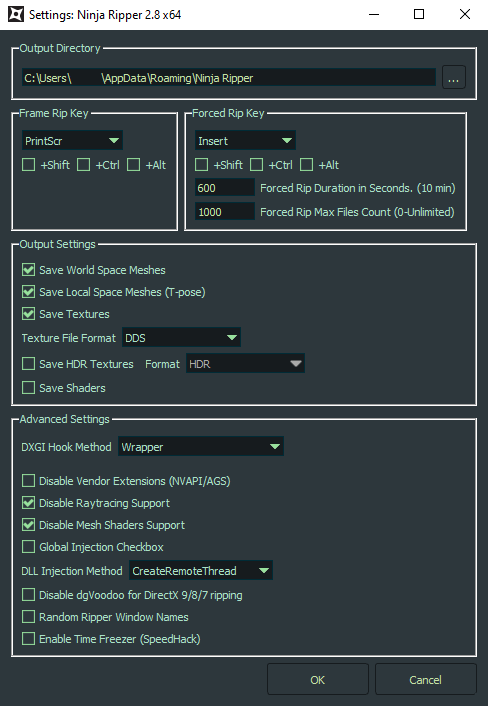
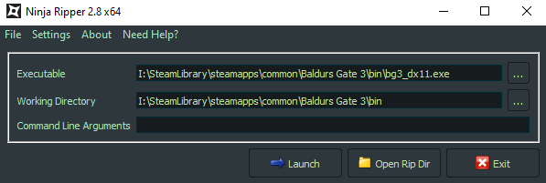
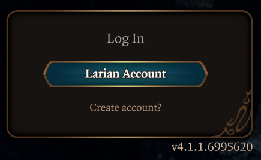
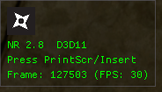
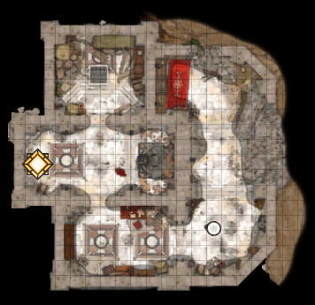
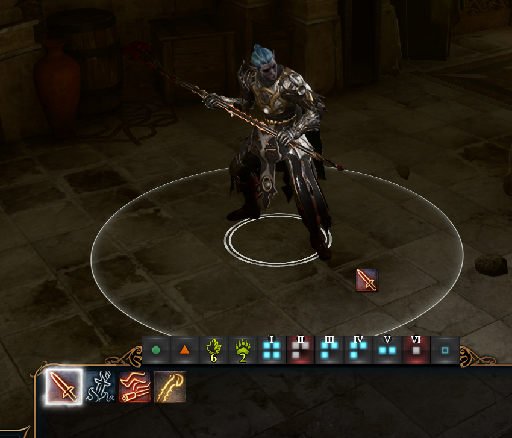
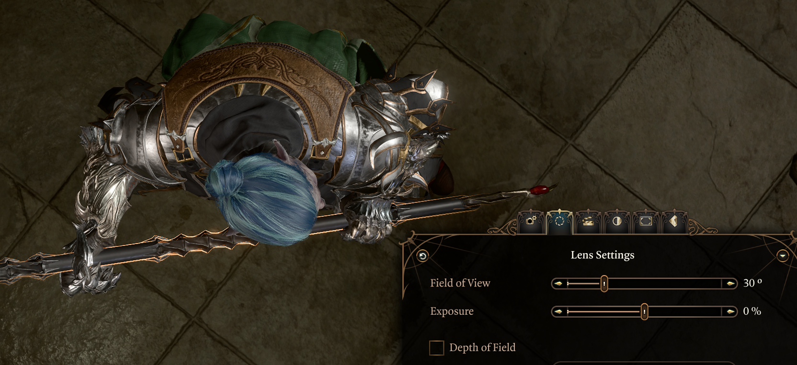

> [!IMPORTANT]
> The author of this guide is not affiliated with NinjaRipper.

---

> [!CAUTION]
> Attention: the program \[NinjaRipper] is intended only for research of the places of the levels of games located "behind" the camera and does not pursue the goal of piracy.

---

# Obtaining the 3D Model

## Installing NinjaRipper

This guide will require a one-time subscription to the [Patreon account of NinjaRipper](https://www.patreon.com/ninjaripper) for **4,50€**.
You will keep access to versions of the software you were subscribed for without limitation if you unsubscribe.

Then you can download and install the software itself: https://www.ninjaripper.com  
Opening the software will open a browser window and prompt you to login.

## Configuration

I don't think that I changed any settings from the default.
Maybe the rip duration because it did not rip everything with the default times.
Just in case check whether there are any differences, I'm not entirely sure.

Then, configure the path to the game executable and directory.

## Launching the game

Ensure that Steam or any other launcher you installed the game with is not started on your computer.
Then, use the "Launch" button to start the game.

The game will tell you that you are not logged into your account, which is completely fine.

There will also be a new overlay in the top left that shows you that NinjaRipper is running in the background.

## Scene preparation

Load the save file you want to extract the character model from.

You will likely be located in one of the large overworld areas of the game.
However, having the game load so many models at once will not only make the ripping process take much longer later, it will also make finding the correct model files in the export later a lot harder.

So, navigate to any cellar, cave or other small subarea in which you are shown a short loading screen (blackout with loading indicator in the bottom right, not full region change).
Only take your character there that you want to get the model from, leave the rest of your party outside.
Place them on a flat surface with space around them to make it easier to find and work with later.

## Character preparation

Now you must decide what clothing/armor, weapons or other equipment the character should be wearing for your model.
Change anything you want, the model will be extracted EXACTLY as seen in the game (except for textures).

With your scene prepared, you must choose a pose for the character to have in the export.
Since we will be switching to photo mode later on anyway, you can also pick any of the poses and expressions from there.

A bit of inspiration:

- Melee attacks
- Casting a spell
- Sitting on a chair
- Doing one of the photo mode poses
- etc.

This is a good time to save your game, just in case any of the next steps crash the game or time it out.

## Extracting the game models

If you haven't already: Activate photo mode using `F9`.

Since the extraction of the models is relative to the camera screen space, we will have to prepare the camera in this special way to make our lives a lot easier later.
Enabling camera mode will allow us to control the camera exactly as we want.
Also, the models might be more detailed in photo mode, but I was unable to confirm this.
Since the game culls objects and model parts that are not visible, we need to position the camera in a way that the entire character is on the screen at once.

- Set FOV to 30
- Place camera right above your character
- Look straight downwards

You should also note down the size of the screen in pixels on which you perform this extraction on.
We will need it later in the [Blender import step](blender-import.md).

This is what it should look like:

Then, press the key as indicated by the NinjaRipper overlay in the top left.
This might be different depending on your configuration of the software.
For me, it's `PrintScr`.
This will start the model extraction, which might take **a long time** depending on the scene size and compute power available.
For me, it's roughly two or three minutes.

You can view the models being extracted in real time if you observe `%APPDATA%\Ninja Ripper` (or press the button in the NinjaRipper UI).
Enter the directory named similar to `2025.12.10_17.46.28_bg3_dx11.exe_2888` or `2025.05.27_13.56.53_bg3_dx11.exe_19876` and view the `frame_0` directory.
Each new extraction will create a new `frame_n` directory.

In this, you will have a directory full of numbered files like `mesh_148.nr` that contain the meshes of the models that were loaded in the game.
